## Disclaimer {background-color="#F5F6F0"}

* The slides were adapted from those of Pierre Michel and Morgan Raux, both researchers at AMSE, who kindly shared their work.

* This slide deck was made with Quarto and reveal.js, it is translated by Claude Sonnet 5 from a LaTex presentation previously made with beamer.


# Introduction {.part}

## Instructor

- Ewen Gallic
- Aix-Marseille School of Economics
- Maître de Conférences (Assistant Prof.) in Economics
- Research interests: data science, algorithmic fairness, environmental economics
- Contact: [ewen.gallic@univ-amu.fr](mailto:ewen.gallic@univ-amu.fr)
- Office: 1-04, Îlot Bernard-du-Bois, Marseille

## Course organization

- Duration: 4 sessions (4 × 3 hours)
- Introduction to programming for data analysis
- Focus on the `R` language
- <span class="hl-blue">Main objective</span>: basic knowledge of `R` + tips to learn autonomously

## What is NOT in the course

::: {.warning}
<span class="box-title">Warning</span>
This course does not cover all regression techniques!
:::

- It mostly focuses on the **basic tools** for <span class="hl-blue">importing</span>, <span class="hl-blue">cleaning</span> and <span class="hl-blue">exploring data</span>.

## Objectives

- Introduction to the **good practices** to start an empirical research project
- By the end of the course, you should be able to import data and conduct the first steps of an <span class="hl-blue">empirical analysis</span>

## Outline of the course

1. **Data management: file paths / `.R` scripts**
2. Cleaning data, combining different data sources (data "wrangling")
3. Producing summary statistics and data visualization
4. Implementing first tests and regressions

## Main reference for the course

:::: {.columns}
::: {.column width="60%"}
Wickham, H., Cetinkaya-Rundel, M., Grolemund, G. 2023. *R for Data Science: Import, Tidy, Transform, Visualize, and Model Data.* O'Reilly Media, Incorporated.

🌐 [https://r4ds.hadley.nz/](https://r4ds.hadley.nz/)
:::
::: {.column width="40%"}
[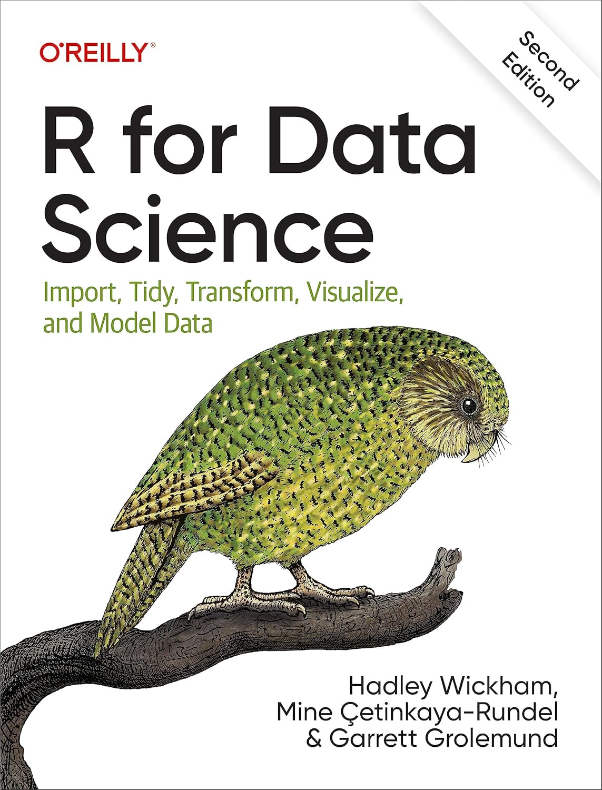](https://r4ds.hadley.nz/)
:::
::::

## What can I get from this course?

This course will (hopefully) be useful for:

- the continuation of your **studies**
- but also for your **professional career**, especially for students who want to:
  - do a PhD and academic research
  - work in public institution
  - work in the private sector

This course will particularly be useful for those who want to work as economist, analyst, data scientist or consultant. Nowadays, a lot goes through **data analysis**.

## Evaluation

- The examination will be a <span class="hl-blue">take-home assignment</span>
- You will have to conduct a **small data project**
- You will have to **find data** and conduct an **empirical analysis** to answer a questionnaire (available on Ametice)
- You will be guided during classes
- If you pay attention during classes, it will not ask you much extra work

## {.center}

::: {.objective style="max-width:50%; margin: 2em auto; text-align:center;"}
**Questions?**
:::

# The R programming language and programming software {.part}

## General information on R

- [`R`](https://www.r-project.org/) (1995, AT&T Bell Laboratories) is a software for **statistical analysis** and **graphics**, it is a clone of `S-PLUS`, mainly written in `C` language.
- `R` is **free software**, distributed freely under the terms of [GNU](https://www.gnu.org/) Public Licence of the [Free Software Foundation](https://www.fsf.org/) (FSF). The development and distribution are ensured by several statisticians (R Development Core Team). It is **compatible with all platforms**.
- Files and instructions for installing `R`, tutorials and updates are available from the [CRAN](http://cran.r-project.org/) (Comprehensive `R` Archive Network).

## Downloading and installing R

- Download `R`:  
  🌐 [https://cloud.r-project.org/](https://cloud.r-project.org/)
- Install `R` on your computer
- `R` is a programming language, it consists of a series of tools (packages)
- After installing `R`, your computer can load these packages and let you use their content (functions, datasets, help pages)

## Downloading and installing RStudio

- Once `R` has been installed, download RStudio:  
  🌐 [https://posit.co/download/rstudio-desktop/](https://posit.co/download/rstudio-desktop/)
- RStudio is a coding environment for `R`

## Interface presentation: .R Script

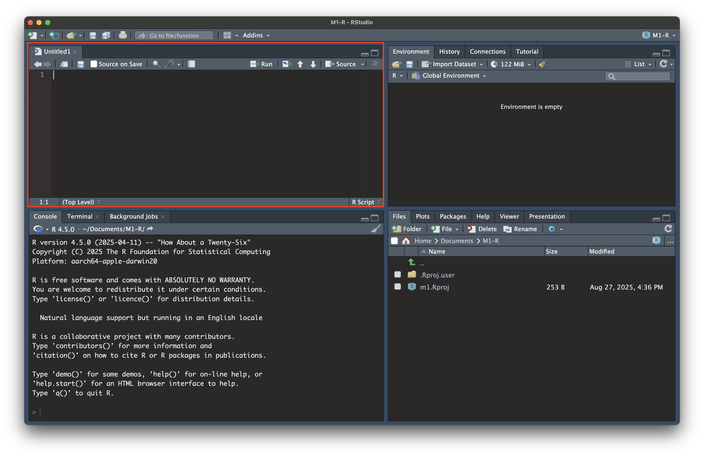

## Interface presentation: the console

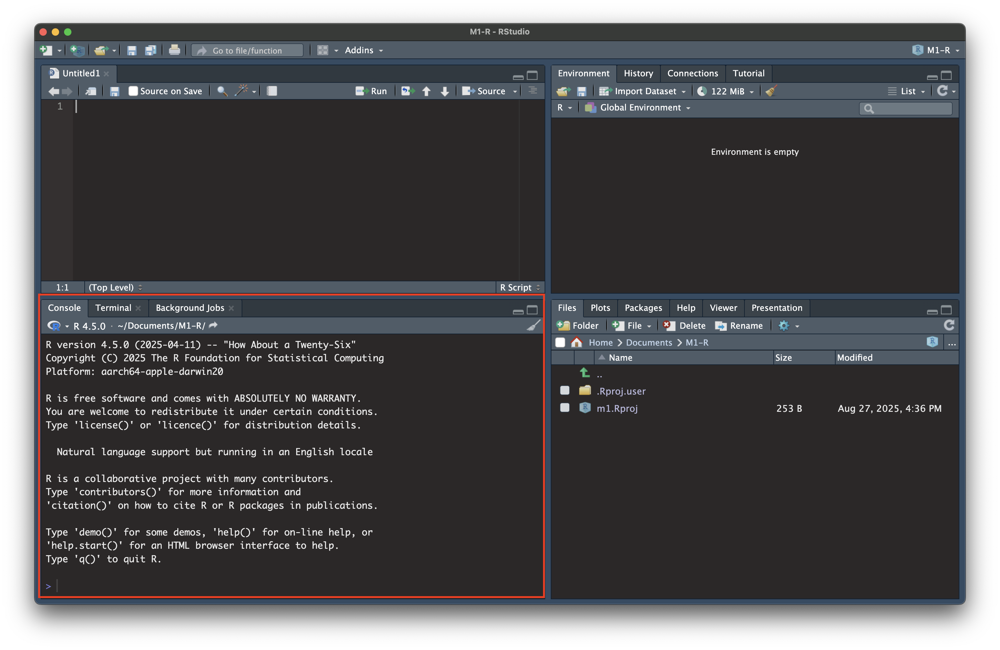

## Interface presentation: where are the data?

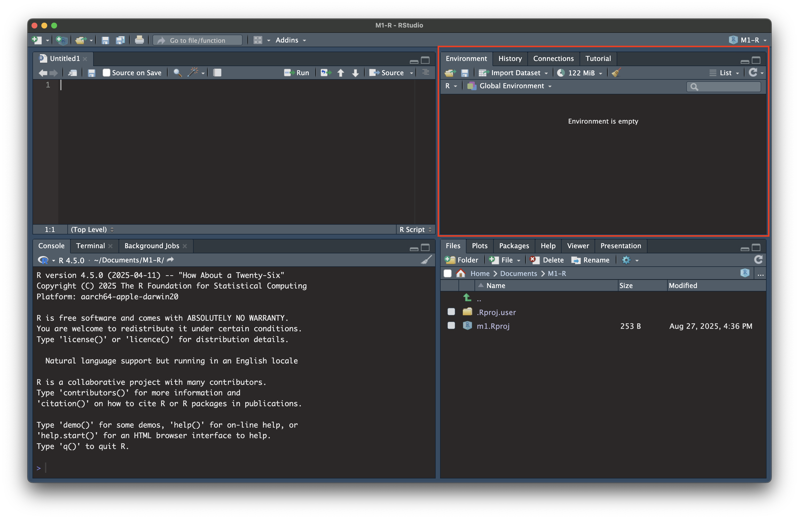

## Interface presentation: file browser

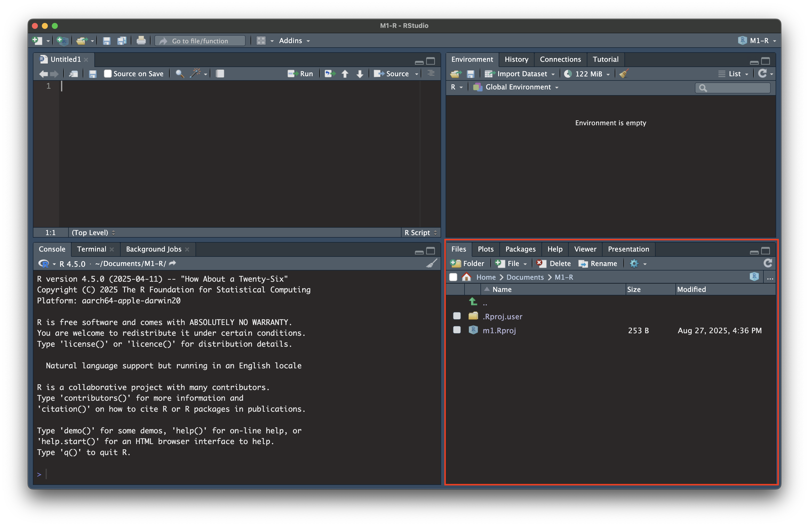

## Interface presentation: viz viewer

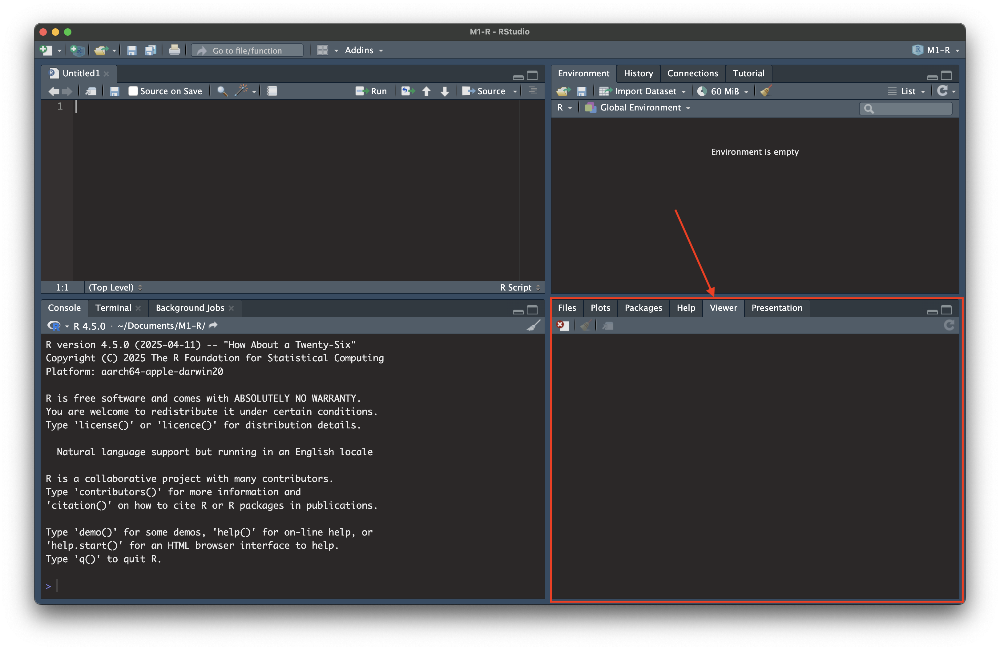

## Interface presentation: the menu

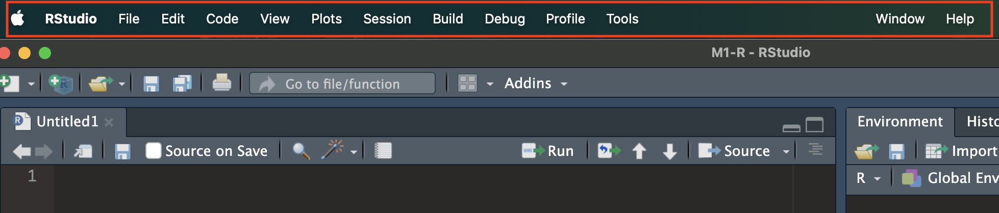

## General information

The `R` programming language is:

1. <span class="hl-purple">interpreted</span>: the **available functions** are located in a library, organized in **packages** containing functions, operators and datasets.
2. <span class="hl-purple">object-oriented</span>: variables, data, results in a R session are stored as **objects** in memory in the **workspace**.


## The R console: your first calculator

- Before writing any script, open the **console** (bottom-left pane in RStudio) and try typing some math directly.
- `R` evaluates whatever you type and prints the result right away, exactly like a calculator.

```r
1 + 1
10 / 3
2^10
sqrt(81)
```

- Try it yourself: type a small calculation directly into the console and press `Enter`.

## Storing values: variables and assignment {.small}

- Typing a calculation in the console is useful, but the result disappears once you move on.
- To **keep** a value, we store it in a <span class="hl-blue">variable</span>, using the assignment operator `<-`.

```r
x <- 5      # x now contains the value 5
y <- 3
x + y       # uses the stored values
```

- Read `x <- 5` as "x gets the value 5".
- Once created, a variable appears in the **Environment** tab of RStudio, and can be reused in later lines of code.

::: {.tip}
<span class="box-title">Tip</span>
`=` also works as an assignment operator in `R`, but `<-` is the convention used by the `R` community: stick to it!
:::

## Comments: leaving notes in your code

- A <span class="hl-blue">comment</span> starts with `#`. Everything after `#` on that line is ignored by `R`. It is there for **humans**, not for the computer.
- Comments explain *why* you wrote a piece of code, so that you (or someone else) can understand it later.

```r
# Compute the average of three exam scores
score_1 <- 12
score_2 <- 15
score_3 <- 9

average_score <- (score_1 + score_2 + score_3) / 3 # simple arithmetic mean
print(average_score)
```

::: {.warning}
<span class="box-title">Get into the habit early</span>
Add comments **as you write your code**, not afterward. A script without comments is much harder to read again in two weeks, even for its own author.
:::

## Data types in R

Every piece of data in `R` has a <span class="hl-green">type</span>. The three most common ones you will encounter are:

- <span class="hl-purple">numeric</span>: numbers, with or without decimals (`2`{.R}, `3.14`{.R}, `-7`{.R}).
- <span class="hl-purple">character</span>: text, always written between quotes (`"Marseille"`{.R}, `"A"`{.R}).
- <span class="hl-purple">logical</span>: only three possible values, `TRUE`{.R}, `FALSE`{.R} or `NA_logical`{.R}.

```r
age <- 25            # numeric
city <- "Marseille"  # character
is_student <- TRUE   # logical
```

## Checking the type of a variable

- The function `class()`{.R} tells you the type of any object in `R`.

```r
class(age)         # "numeric"
class(city)        # "character"
class(is_student)  # "logical"
```

- This is very useful when debugging: many errors come from a variable having a different type than what you expected.

::: {.tip}
<span class="box-title">Tip</span>
Logical values behave like numbers in disguise: `TRUE`{.R} equals `1`{.R} and `FALSE`{.R} equals `0`{.R}. Try `TRUE + TRUE`{.R} in your console!
:::

## Vectors: grouping values together

- A <span class="hl-green">vector</span> is an ordered collection of values of the **same type**. It is built with the function `c()`{.R} (for "combine").

```r
ages <- c(25, 31, 42, 19)
cities <- c("Marseille", "Paris", "Lyon")
is_passing <- c(TRUE, FALSE, TRUE, TRUE)
```

- A single number, like `age <- 25`{.R} earlier, is technically just a vector of length 1.
- Vectors are the building block of almost everything else in `R`.

## Working with vectors

- Arithmetic operations apply to a whole vector at once (this is called <span class="hl-blue">vectorization</span>).

```r
ages <- c(25, 31, 42, 19)
ages + 1        # adds 1 to every element
mean(ages)      # average of the vector
length(ages)    # number of elements
```

- Use square brackets `[ ]` to access a specific element by its position.

```r
ages[1]   # first element: 25
ages[3]   # third element: 42
```
- To get multiple elements by their positions, use a vector:

```r
ages[c(1,3)]   # first and third elements: 25 and 42
```


## Matrices: vectors in two dimensions

- A <span class="hl-green">matrix</span> is a rectangular collection of values of the **same type**, arranged in rows and columns.

```r
m <- matrix(
    c(1, 2, 3, 4, 5, 6),
    nrow = 2, ncol = 3
)
print(m)
```

- Use two indices in square brackets, `[row, column]`, to access a specific element.

```r
m[1, 2]  # element in row 1, column 2
m[2, ]   # entire second row
```

## Data frames: tables of data

- A <span class="hl-green">data frame</span> is the structure you will use the most in this course: it is a **table**, where each column can have its own type (numeric, character, logical...).
- It is built with the function `data.frame()`.

```r
students <- data.frame(
    name = c("Alice", "Bob", "Chloé"),
    age = c(21, 23, 22),
    is_erasmus = c(TRUE, FALSE, TRUE)
)
print(students)
```

- Each row is an observation, each column is a variable.

## Basic structures: summary

| Structure | Dimensions | Types allowed | Built with |
|:---|:---:|:---:|:---|
| Vector | 1D | one type | `c()` |
| Matrix | 2D | one type | `matrix()` |
| Data frame | 2D | one type *per column* | `data.frame()` |

- Data frames are the closest to what you already know as a "spreadsheet" or a "dataset".
- Most of this course will consist of manipulating data frames.

## Exercise {.exercise .small}

```{r}
#| echo: false
countdown::countdown(
  minutes = 10,
  seconds = 0,
  top = "0%",
  right = "5%",
  font_size = "1.8em",
  color_border = "#0d6efd",
  color_text = "#0d6efd"
)
```

1. Create a variable `budget` containing the number `1500`{.R}. Add a comment above the line explaining what it stores.
2. Create a variable `name` containing your first name, and a variable `is_registered` set to `TRUE`{.R}.
3. Use `class()`{.R} to check the type of each of the three variables you just created.
4. Create a vector `weekly_expenses` containing four numbers of your choice.
5. Compute the total and the average of `weekly_expenses`, using `sum()`{.R} and `mean()`{.R}.
6. Build a small data frame `budget_tracker` with two columns: `item` (a character vector with 3 expense categories, e.g. `"Rent"`{.R}, `"Food"`{.R}, `"Transport"`{.R}) and `amount` (a numeric vector with 3 corresponding amounts).
7. Print `budget_tracker`, then check the class of each of its two columns.

## Solution {.exercisesol}

```r
# budget: how much money is available this month (numeric)
budget <- 1500

# name: my first name (character)
name <- "Camille"

# is_registered: whether I am registered for the course (logical)
is_registered <- TRUE

class(budget)          # "numeric"
class(name)            # "character"
class(is_registered)   # "logical"

# A vector of 4 weekly expenses
weekly_expenses <- c(120, 95, 60, 140)

sum(weekly_expenses)    # total expenses
mean(weekly_expenses)   # average weekly expense

# A small data frame tracking a few budget items
budget_tracker <- data.frame(
    item = c("Rent", "Food", "Transport"),
    amount = c(600, 250, 80)
)
print(budget_tracker)

class(budget_tracker$item)    # "character"
class(budget_tracker$amount)  # "numeric"
```

## Sources to find help

- The help pages of the `R` packages
- [Stackoverflow](https://stackoverflow.com/): generalist forum for coding help
- Just google your question including "R" as a keyword in your search
- Search on Youtube
- Ask a generative AI chatbot (e.g., ChatGPT, Claude, Gemini)

## A good help for coding: ChatGPT

- Gen AI are incredibly useful to learn coding, especially in `R` (also true for Python)
- You can just ask the bot how to code "task 1" or "task 2" in `R`
- For simple tasks, you don't even need to know anything about `R`
- However, <span class="hl-orange">ChatGPT is not magic</span>. Answers are sometimes irrelevant and **you need to understand the `R` language** to interpret the error messages you can face and adapt the code accordingly
- Let us take 5 minutes to create an OpenAI account to use ChatGPT.  
  🌐 [https://chatgpt.com/](https://chatgpt.com/)

# Concepts {.part}

## What is a data analysis?

- Doing a data analysis can be viewed as:
  - putting together data, preparing them,
  - computing <span class="hl-blue">statistics</span> (descriptive, clustering, PCA, …), comparing,
  - <span class="hl-blue">extract information/knowledge</span> and communicate them (text, figures, visualization)
- We often create groups of observations
- These groups might be defined by country, city, company, university, time period, ethnicity, hair color, …
- Let us consider a few examples

## Example 1: comparison across countries

<!-- 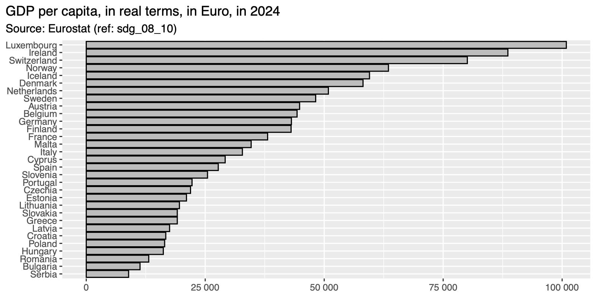 -->
```{r}
#| echo: false
#| warning: false
#| message: false
library(tidyverse)
gdp <- read_csv("data/sdg_08_10_page_linear_2_0.csv")

ggplot(
  data = gdp |> filter(
    TIME_PERIOD == 2024,
    !str_detect(`Geopolitical entity (reporting)`, "Euro")
  ),
  mapping = aes(
    x = OBS_VALUE,
    y = fct_reorder(`Geopolitical entity (reporting)`, OBS_VALUE)
  )
) +
  geom_bar(fill = "grey", colour = "black", stat = "identity") +
  labs(
    x = NULL, y = NULL,
    title = "GDP per capita, in real terms, in Euro, in 2024",
    subtitle = "Source: Eurostat (ref: sdg_08_10)"
  ) +
  scale_x_continuous(labels = scales::label_number(suffix = "", scale = 1)) +
  theme(plot.title.position = "plot")

```


## Example 2: comparison across cities

:::: {.columns}
::: {.column width="30%"}
Comparing voter turnout between French cities for the 2024 parliamentary elections.

Source: data.gouv.fr
:::
::: {.column width="70%"}
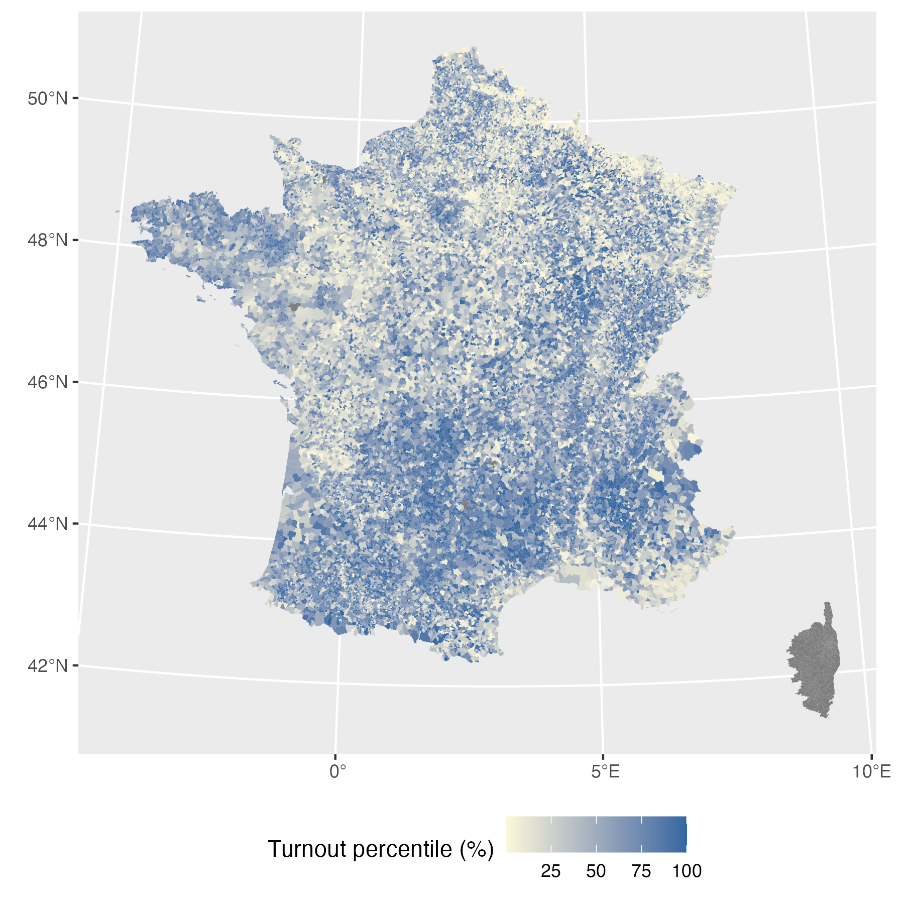{width="80%"}
:::
::::

## Example 3: comparison over time

Comparing the number of inhabitants in Aix-en-Provence over the years
```{r}
#| echo: false
#| warning: false
#| message: false
library(tidyverse)
library(ggplot2)

ggplot(
  data = tibble(
    year = c(1968, 1975, 1982, 1990, 1999, 2006, 2011, 2016, 2022),
    pop = c(89566, 110659, 121327, 123842, 134222, 142534, 140684, 143006, 147933)
  ),
  mapping = aes(x = year, y = pop)
) +
  geom_line() +
  geom_point() +
  labs(x = "Year", y = NULL, title = "Population in Aix-en-Provence") +
  scale_x_continuous(n.breaks = 10) +
  scale_y_continuous(labels = scales::label_number(), limits = c(0, 150000)) +
  theme(plot.title.position = "plot")
```


<!--  -->

## Data analyses are increasingly present in our lives

:::: {.columns}
::: {.column width="40%"}
Data analyses create "knowledge" out of data.

Over 89 per cent of autistic adults aged 40+ are undiagnosed.

Source: *Annual Review of Developmental Psychology*[^1], [King's College London](https://www.kcl.ac.uk/news/up-to-90-of-middle-aged-and-older-autistic-adults-are-undiagnosed-in-the-uk-new-review-finds)
:::
::: {.column width="60%"}
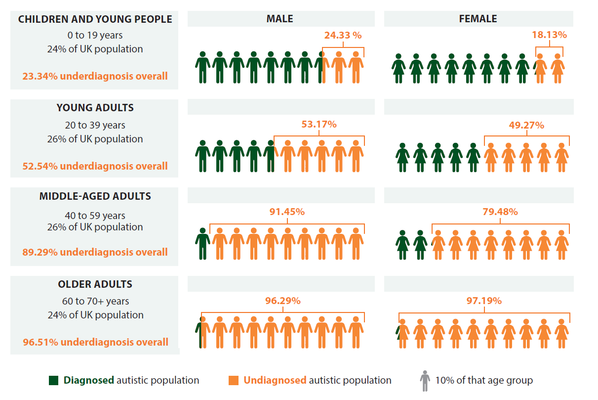
:::
::::

[^1]: Stewart, G. R., & Happé, F. (2025). Aging Across the Autism Spectrum. *Annual Review of Developmental Psychology*. [https://doi.org/10.1146/annurev-devpsych-111323-090813](https://doi.org/10.1146/annurev-devpsych-111323-090813)

## Data analyses are increasingly present in our lives

:::: {.columns}
::: {.column width="40%"}
Data analyses are also used to take decisions.

* CTR: Click through rate, i.e., number of clics divided by number of impression.
* CPA: Cost per action, i.e., total marketing cost divided by the total number of actions achieved.
:::
::: {.column width="60%"}
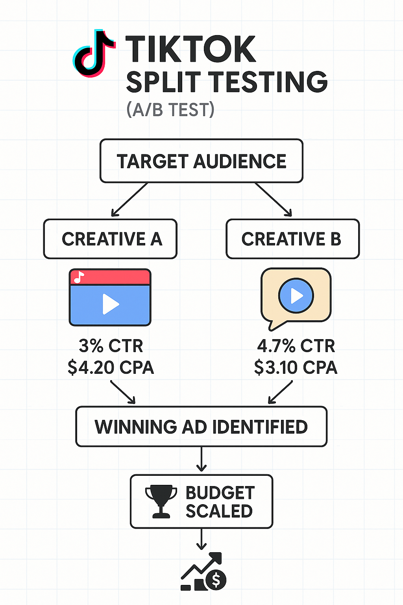{width="50%"}


:::
::::

## Who are doing data analyses?

- Research institutions (universities, research centers, etc.)
- Private companies (start-ups, big corporations, etc.)
- Public institutions (ministries, OECD, IMF, etc.)

Data analysis is one of the most important skills you can provide at the beginning of your "economist" career.

## What are the data?

- Definition: we can call <span class="hl-green">data</span> anything that can be measured AND structured into a dataset
- Where do they come from?
  - <span class="hl-purple">Survey Data</span>: responses collected from a group of individuals using a structured questionnaire to gather information on various topics.
  - <span class="hl-purple">Sensor Data</span>: continuous measurements recorded by sensors, such as temperature, humidity, or motion.
  - <span class="hl-purple">Transaction Data</span>: records of individual transactions in a business, including details like date, time, amount, and items purchased.
  - <span class="hl-purple">Administrative data</span>: data collected and maintained by organizations or institutions as part of their routine operations and administrative processes.

## What is a dataset?

Definition: A <span class="hl-green">dataset</span> is a collection of data, typically organized in a structured format. It consists of multiple observations (rows), each described by one or more variables (columns).

| ID | Name | Age | Gender | Income |
|:--:|:-----|:---:|:------:|:------:|
| 1 | Alice | 30 | Female | 55000 |
| 2 | Bob | 45 | Male | 60000 |
| 3 | Charlie | 25 | Male | 50000 |

- Each row (ID 1 to 3) is an <span class="hl-green">observation</span>. It represents a different individual.
- The columns (ID, Name, Age, Gender, Income) are the <span class="hl-green">variables</span>. They represent different characteristics of the individuals.

## What are the different types of data in economics?

In economics, we mostly find the following data structures:

1. <span class="hl-green">Cross-sectional data</span>: data collected at a single point in time **across multiple units** (e.g., individuals, households, firms, countries, regions, …)
2. <span class="hl-green">Panel data</span>: data that follows multiple units (e.g., individuals, firms, countries) over two or more time periods.
   - You may also have heard the term **longitudinal data** to refer to panel data.

## Cross section data example

| Id | Name | University | Earnings |
|:--:|:-----|:-----------|:--------:|
| 1 | Alex | Harvard | 120K |
| 2 | Sarah | Yale | 100K |
| 3 | Marie | NYU | 110K |

In this example, the **unit of observation** is (individual).

## Panel data example

| Id | Name | University | Application | Earnings |
|:--:|:-----|:-----------|:------------|:--------:|
| 1 | Alex | Harvard | Harvard | 120K |
| 1 | Alex | Harvard | Princeton | 120K |
| 2 | Sarah | Yale | Yale | 100K |
| 2 | Sarah | Yale | Stanford | 100K |
| 2 | Sarah | Yale | UC Berkeley | 100K |
| 3 | Marie | Princeton | Princeton | 110K |
| 3 | Marie | Princeton | Harvard | 110K |

In this example, the **unit of observation** is (individual, application).

## Panel data example 2

| Id | Name | Univ. | Appl. 1 | Appl. 2 | Appl. 3 | Earnings | Year |
|:--:|:-----|:------|:--------|:--------|:--------|:--------:|:----:|
| 1 | Alex | Harvard | Harvard | Princeton | . | 120K | 2010 |
| 1 | Alex | Harvard | Harvard | Princeton | . | 130K | 2011 |
| 1 | Alex | Harvard | Harvard | Princeton | . | 150K | 2012 |
| 2 | Sarah | Yale | Yale | Stanford | UC Berkeley | 100K | 2010 |
| 2 | Sarah | Yale | Yale | Stanford | UC Berkeley | 100K | 2011 |
| 2 | Sarah | Yale | Yale | Stanford | UC Berkeley | 105K | 2012 |
| 3 | Marie | Princeton | Princeton | Harvard | . | 110K | 2010 |
| 3 | Marie | Princeton | Princeton | Harvard | . | 90K | 2011 |
| 3 | Marie | Princeton | Princeton | Harvard | . | 110K | 2012 |

In this example, the **unit of observation** is (individual, year).

## What do we compare in a data analysis?

Two key concepts to properly understand the comparisons we make in data analyses:

- Unit of observation
- Sources of variations

## Unit of observation

- <span class="hl-green">Unit of observation</span>: the entity that each row of your data represents. It could be an individual, a household, a company, a country, a year, an event, or any other entity depending on the context of your study.
- If each row in your dataset represents a person, then the unit of observation is an individual.
  - Example: A dataset containing survey responses from 1,000 people, where each row represents one person's responses.
- If each row represents a company, then the unit of observation is a company.
  - Example: A dataset with financial data for 100 companies.

## Sources of variations

- Implementing a data analysis boils down to making comparisons.
- The comparisons we can do depend on the data we have.
- Depending on the structure of the data, there are different types of comparisons we can make.
- Depending on the comparison we are making, we can exploit different sources of variations.
- Let us consider several examples to better understand.

## Example 1: Survey among students

I have collected information among students with a google questionnaire on April 20, 2024.

What is the structure of my dataset?

1. Cross-section dataset
2. Panel dataset

::: {.quiz-answer .fragment}
**Answer:** Cross-section dataset
:::

## Example 1: Survey among students

What is the unit of observation in this dataset?

1. A group of students
2. A student in a given year
3. A student

::: {.quiz-answer .fragment}
**Answer:** A student
:::

## Example 1: Survey among students

What comparisons can I make out of this dataset? (what are the sources of variations?)

1. I can compare universities
2. I can compare students with each other
3. I can compare students over time

::: {.quiz-answer .fragment}
**Answer:** I can compare students with each other
:::

## Example 2: Payments list

Let us imagine we have access to the list of all payments made by the clients of one bank.

What is the structure of my dataset?

1. Cross-section dataset
2. Panel dataset

::: {.quiz-answer .fragment}
**Answer:** Panel dataset
:::

## Example 2: Payments list

What is the unit of observation in this dataset?

1. A payment
2. A customer of the bank
3. A customer in a specific year

::: {.quiz-answer .fragment}
**Answer:** A payment
:::

## Example 2: Payments list

What comparisons can I make out of this dataset? (what are the sources of variations?)

1. I can compare the payments made by different customers
2. I can compare the payments made over time
3. I can compare the payments made by one customer over time

::: {.quiz-answer .fragment}
**All three** are valid sources of variation here.
:::

## Identifying the right source of variations

- There is often several sources of variations in one dataset.
- To make accurate interpretation of the statistics we are going to produce, we need to understand what exactly are the variations we are exploiting.
- In other words, we need to perfectly understand the comparisons we are making.

# Good practices for data analyses {.part}

## Why good coding practices are important?

- Coding is a critical component of high-quality reproducible research (true for both academic and non-academic research).
- Save time and energy: coding enables you to automate everything that can be done.
- Coding also enables you to keep track of all steps you implemented to obtain a specific estimate.

## Organizing folders

- Over the life-cycle of a project, we accumulate files...
- These originate from:
  - Getting raw data,
  - Writing programs to process the data,
  - Putting together data for analysis,
  - Generating tables, graphs and figures.
- And, of course, there are several versions of all of the above.
- All of these files should be sorted in folders.

## My suggestion of folder structure {.smaller}

:::: {.columns}
::: {.column width="35%"}
::: {.dirtree}
<span class="dir">Root</span><br>
&nbsp;&nbsp;<span class="dir">data</span><br>
&nbsp;&nbsp;&nbsp;&nbsp;<span class="dir">raw</span><br>
&nbsp;&nbsp;&nbsp;&nbsp;<span class="dir">tmp</span><br>
&nbsp;&nbsp;&nbsp;&nbsp;<span class="dir">out</span><br>
&nbsp;&nbsp;<span class="dir">functions</span><br>
&nbsp;&nbsp;&nbsp;&nbsp;<span class="file">utils.R</span><br>
&nbsp;&nbsp;<span class="dir">scripts</span><br>
&nbsp;&nbsp;&nbsp;&nbsp;<span class="file">your-script-1.R</span><br>
&nbsp;&nbsp;&nbsp;&nbsp;<span class="file">your-script-2.R</span><br>
&nbsp;&nbsp;<span class="dir">notebooks</span><br>
&nbsp;&nbsp;&nbsp;&nbsp;<span class="file">your-notebook-1.Rmd</span><br>
&nbsp;&nbsp;&nbsp;&nbsp;<span class="file">your-notebook-2.Rmd</span><br>
&nbsp;&nbsp;<span class="dir">figs</span><br>
&nbsp;&nbsp;<span class="dir">tables</span><br>
&nbsp;&nbsp;<span class="dir">references</span><br>
&nbsp;&nbsp;<span class="file">README.md</span><br>
&nbsp;&nbsp;<span class="file">project.Rproj</span>
:::
:::
::: {.column width="65%"}
- <span class="hl-green">Root</span> is, here, your **working directory**: the default folder where your programs look for files to read, and where they save the files you create, unless you tell them otherwise.
  - It's like the "home base" for your project. When you use a **relative path** (e.g., `"data/raw/data.csv"`), R looks for that file starting from the working directory.
  - You can always change it (`setwd()`), but best practice is to keep it at your project's root folder.
  - Analogy with a GPS: "Go north two green lights" only makes sense if we know where you're starting from.
:::
::::

## Root folders — `data/` {.smaller}

:::: {.columns}
::: {.column width="35%"}
::: {.dirtree}
<span class="dir">Root</span><br>
&nbsp;&nbsp;<span class="dir-current">data</span><br>
&nbsp;&nbsp;&nbsp;&nbsp;<span class="dir-current">raw</span><br>
&nbsp;&nbsp;&nbsp;&nbsp;<span class="dir-current">tmp</span><br>
&nbsp;&nbsp;&nbsp;&nbsp;<span class="dir-current">out</span><br>
&nbsp;&nbsp;<span class="dir">functions</span><br>
&nbsp;&nbsp;&nbsp;&nbsp;<span class="file">utils.R</span><br>
&nbsp;&nbsp;<span class="dir">scripts</span><br>
&nbsp;&nbsp;&nbsp;&nbsp;<span class="file">your-script-1.R</span><br>
&nbsp;&nbsp;&nbsp;&nbsp;<span class="file">your-script-2.R</span><br>
&nbsp;&nbsp;<span class="dir">notebooks</span><br>
&nbsp;&nbsp;&nbsp;&nbsp;<span class="file">your-notebook-1.Rmd</span><br>
&nbsp;&nbsp;&nbsp;&nbsp;<span class="file">your-notebook-2.Rmd</span><br>
&nbsp;&nbsp;<span class="dir">figs</span><br>
&nbsp;&nbsp;<span class="dir">tables</span><br>
&nbsp;&nbsp;<span class="dir">references</span><br>
&nbsp;&nbsp;<span class="file">README.md</span><br>
&nbsp;&nbsp;<span class="file">project.Rproj</span>
:::
:::
::: {.column width="65%"}
<span class="hl-green">data</span>: includes your data in folders:

- <span class="hl-green">raw</span>: the raw data you have collected
- <span class="hl-green">tmp</span>: temporary modified data you create along the process but will not include when/if you share your codes
- <span class="hl-green">out</span>: final data files you will be using in the analysis
:::
::::

## Root folders — `functions/` {.smaller}

:::: {.columns}
::: {.column width="35%"}
::: {.dirtree}
<span class="dir">Root</span><br>
&nbsp;&nbsp;<span class="dir">data</span><br>
&nbsp;&nbsp;&nbsp;&nbsp;<span class="dir">raw</span><br>
&nbsp;&nbsp;&nbsp;&nbsp;<span class="dir">tmp</span><br>
&nbsp;&nbsp;&nbsp;&nbsp;<span class="dir">out</span><br>
&nbsp;&nbsp;<span class="dir-current">functions</span><br>
&nbsp;&nbsp;&nbsp;&nbsp;<span class="file-current">utils.R</span><br>
&nbsp;&nbsp;<span class="dir">scripts</span><br>
&nbsp;&nbsp;&nbsp;&nbsp;<span class="file">your-script-1.R</span><br>
&nbsp;&nbsp;&nbsp;&nbsp;<span class="file">your-script-2.R</span><br>
&nbsp;&nbsp;<span class="dir">notebooks</span><br>
&nbsp;&nbsp;&nbsp;&nbsp;<span class="file">your-notebook-1.Rmd</span><br>
&nbsp;&nbsp;&nbsp;&nbsp;<span class="file">your-notebook-2.Rmd</span><br>
&nbsp;&nbsp;<span class="dir">figs</span><br>
&nbsp;&nbsp;<span class="dir">tables</span><br>
&nbsp;&nbsp;<span class="dir">references</span><br>
&nbsp;&nbsp;<span class="file">README.md</span><br>
&nbsp;&nbsp;<span class="file">project.Rproj</span>
:::
:::
::: {.column width="65%"}
<span class="hl-green">functions</span>: folder containing the scripts with the functions you wrote.

The script files will be loaded in your analysis scripts, using the `source()` function.
:::
::::

## Root folders — `scripts/` {.smaller}

:::: {.columns}
::: {.column width="35%"}
::: {.dirtree}
<span class="dir">Root</span><br>
&nbsp;&nbsp;<span class="dir">data</span><br>
&nbsp;&nbsp;&nbsp;&nbsp;<span class="dir">raw</span><br>
&nbsp;&nbsp;&nbsp;&nbsp;<span class="dir">tmp</span><br>
&nbsp;&nbsp;&nbsp;&nbsp;<span class="dir">out</span><br>
&nbsp;&nbsp;<span class="dir">functions</span><br>
&nbsp;&nbsp;&nbsp;&nbsp;<span class="file">utils.R</span><br>
&nbsp;&nbsp;<span class="dir-current">scripts</span><br>
&nbsp;&nbsp;&nbsp;&nbsp;<span class="file-current">your-script-1.R</span><br>
&nbsp;&nbsp;&nbsp;&nbsp;<span class="file-current">your-script-2.R</span><br>
&nbsp;&nbsp;<span class="dir">notebooks</span><br>
&nbsp;&nbsp;&nbsp;&nbsp;<span class="file">your-notebook-1.Rmd</span><br>
&nbsp;&nbsp;&nbsp;&nbsp;<span class="file">your-notebook-2.Rmd</span><br>
&nbsp;&nbsp;<span class="dir">figs</span><br>
&nbsp;&nbsp;<span class="dir">tables</span><br>
&nbsp;&nbsp;<span class="dir">references</span><br>
&nbsp;&nbsp;<span class="file">README.md</span><br>
&nbsp;&nbsp;<span class="file">project.Rproj</span>
:::
:::
::: {.column width="65%"}
<span class="hl-green">scripts</span>: folder containing the scripts you write to prepare the data and to perform the analysis.
:::
::::

## Root folders — `notebooks/` {.smaller}

:::: {.columns}
::: {.column width="35%"}
::: {.dirtree}
<span class="dir">Root</span><br>
&nbsp;&nbsp;<span class="dir">data</span><br>
&nbsp;&nbsp;&nbsp;&nbsp;<span class="dir">raw</span><br>
&nbsp;&nbsp;&nbsp;&nbsp;<span class="dir">tmp</span><br>
&nbsp;&nbsp;&nbsp;&nbsp;<span class="dir">out</span><br>
&nbsp;&nbsp;<span class="dir">functions</span><br>
&nbsp;&nbsp;&nbsp;&nbsp;<span class="file">utils.R</span><br>
&nbsp;&nbsp;<span class="dir">scripts</span><br>
&nbsp;&nbsp;&nbsp;&nbsp;<span class="file">your-script-1.R</span><br>
&nbsp;&nbsp;&nbsp;&nbsp;<span class="file">your-script-2.R</span><br>
&nbsp;&nbsp;<span class="dir-current">notebooks</span><br>
&nbsp;&nbsp;&nbsp;&nbsp;<span class="file-current">your-notebook-1.Rmd</span><br>
&nbsp;&nbsp;&nbsp;&nbsp;<span class="file-current">your-notebook-2.Rmd</span><br>
&nbsp;&nbsp;<span class="dir">figs</span><br>
&nbsp;&nbsp;<span class="dir">tables</span><br>
&nbsp;&nbsp;<span class="dir">references</span><br>
&nbsp;&nbsp;<span class="file">README.md</span><br>
&nbsp;&nbsp;<span class="file">project.Rproj</span>
:::
:::
::: {.column width="65%"}
<span class="hl-green">notebooks</span>: your notebooks explaining step-by-step your methodology/codes.
:::
::::

## Root folders — `figs/` and `tables/` {.smaller}

:::: {.columns}
::: {.column width="35%"}
::: {.dirtree}
<span class="dir">Root</span><br>
&nbsp;&nbsp;<span class="dir">data</span><br>
&nbsp;&nbsp;&nbsp;&nbsp;<span class="dir">raw</span><br>
&nbsp;&nbsp;&nbsp;&nbsp;<span class="dir">tmp</span><br>
&nbsp;&nbsp;&nbsp;&nbsp;<span class="dir">out</span><br>
&nbsp;&nbsp;<span class="dir">functions</span><br>
&nbsp;&nbsp;&nbsp;&nbsp;<span class="file">utils.R</span><br>
&nbsp;&nbsp;<span class="dir">scripts</span><br>
&nbsp;&nbsp;&nbsp;&nbsp;<span class="file">your-script-1.R</span><br>
&nbsp;&nbsp;&nbsp;&nbsp;<span class="file">your-script-2.R</span><br>
&nbsp;&nbsp;<span class="dir">notebooks</span><br>
&nbsp;&nbsp;&nbsp;&nbsp;<span class="file">your-notebook-1.Rmd</span><br>
&nbsp;&nbsp;&nbsp;&nbsp;<span class="file">your-notebook-2.Rmd</span><br>
&nbsp;&nbsp;<span class="dir-current">figs</span><br>
&nbsp;&nbsp;<span class="dir-current">tables</span><br>
&nbsp;&nbsp;<span class="dir">references</span><br>
&nbsp;&nbsp;<span class="file">README.md</span><br>
&nbsp;&nbsp;<span class="file">project.Rproj</span>
:::
:::
::: {.column width="65%"}
<span class="hl-green">figs</span> and <span class="hl-green">tables</span>: folders containing the exported figures and tables produced by your analysis.
:::
::::

## Root folders — `references/` {.smaller}

:::: {.columns}
::: {.column width="35%"}
::: {.dirtree}
<span class="dir">Root</span><br>
&nbsp;&nbsp;<span class="dir">data</span><br>
&nbsp;&nbsp;&nbsp;&nbsp;<span class="dir">raw</span><br>
&nbsp;&nbsp;&nbsp;&nbsp;<span class="dir">tmp</span><br>
&nbsp;&nbsp;&nbsp;&nbsp;<span class="dir">out</span><br>
&nbsp;&nbsp;<span class="dir">functions</span><br>
&nbsp;&nbsp;&nbsp;&nbsp;<span class="file">utils.R</span><br>
&nbsp;&nbsp;<span class="dir">scripts</span><br>
&nbsp;&nbsp;&nbsp;&nbsp;<span class="file">your-script-1.R</span><br>
&nbsp;&nbsp;&nbsp;&nbsp;<span class="file">your-script-2.R</span><br>
&nbsp;&nbsp;<span class="dir">notebooks</span><br>
&nbsp;&nbsp;&nbsp;&nbsp;<span class="file">your-notebook-1.Rmd</span><br>
&nbsp;&nbsp;&nbsp;&nbsp;<span class="file">your-notebook-2.Rmd</span><br>
&nbsp;&nbsp;<span class="dir">figs</span><br>
&nbsp;&nbsp;<span class="dir">tables</span><br>
&nbsp;&nbsp;<span class="dir-current">references</span><br>
&nbsp;&nbsp;<span class="file">README.md</span><br>
&nbsp;&nbsp;<span class="file">project.Rproj</span>
:::
:::
::: {.column width="65%"}
<span class="hl-green">references</span>: folder containing the PDF versions of the academic papers or documents from the grey literature used to perform your analysis.
:::
::::

## Some conventions and recommendations

- Never use spaces in folder or file names, to keep them **machine readable**.
  - Replace spaces with hyphens (`-`, best practice if you plan on sharing files on the Internet), or with underscores (`_`).
- In your scripts, use comprehensive names for your variables, and try to make the names as short as possible.
  - Avoid calling variables `a`, `aa`, `aaa`, `foo`, `bar`, …
- **Add comments** to your code **at the same time as you write your scripts**: while you may view this as losing time, it will not only help you return more easily to what you did, but it will also benefit other readers who may try to reuse your scripts.
- <span class="hl-blue">Please read the following short guide</span> made by people from the tidyverse community: [https://style.tidyverse.org/](https://style.tidyverse.org/)

## A few tips on file names {.small}

- Use prefixes and suffixes in your script files names.
- Having sequence numbers prefixed to script files helps sort them out and align them with the workflow, while suffixes track the version numbers.
- Example:
  - `01-prepare-data-v4.R`
  - `02-merge-v2.R`
  - `03-summary-statistics-v11.R`
  - `04-regressions-v15.R`
- Drawback: if you want to add an additional step, you'll need to rename files in batches.
- Move older files away from the main folders: create an `old` folder inside your `scripts` folder.
- Apply the same naming conventions to graphs and tables.

## Set Your RStudio Project {.exercise .small}

```{r}
#| echo: false
countdown::countdown(
  minutes = 5,
  seconds = 0,
  top = "0%",
  right = "5%",
  font_size = "1.8em",
  color_border = "#0d6efd",
  color_text = "#0d6efd"
)
```

:::: {.columns}
::: {.column width="30%"}
::: {.dirtree}
<span class="dir">Root</span><br>
&nbsp;&nbsp;<span class="dir">data</span><br>
&nbsp;&nbsp;&nbsp;&nbsp;<span class="dir">raw</span><br>
&nbsp;&nbsp;&nbsp;&nbsp;<span class="dir">tmp</span><br>
&nbsp;&nbsp;&nbsp;&nbsp;<span class="dir">out</span><br>
&nbsp;&nbsp;<span class="dir">functions</span><br>
&nbsp;&nbsp;<span class="dir">scripts</span><br>
&nbsp;&nbsp;<span class="dir">notebooks</span><br>
&nbsp;&nbsp;<span class="dir">figs</span><br>
&nbsp;&nbsp;<span class="dir">tables</span><br>
&nbsp;&nbsp;<span class="dir">references</span><br>
&nbsp;&nbsp;<span class="file">project.Rproj</span>
:::
:::
::: {.column width="70%"}


1. **Open RStudio**

2. **Create a new project**

   * `File` → `New Project...`
   * Choose **New Directory**
   * Create a project named `session-1`

3. **Create the project structure**

   In the R console, run:

```{r}
#| eval: false
#| echo: true
dir.create("data")
dir.create("data/raw")
dir.create("data/tmp")
dir.create("data/out")
dir.create("functions")
dir.create("scripts")
dir.create("notebooks")
dir.create("figs")
dir.create("tables")
dir.create("references")
```


:::
::::

## Setting up a project with RStudio

- Now that we have created all the different folders from our architecture, we can create an `.Rproj` file.
- RStudio is a coding environment for `R`.
- We can use its graphical interface to import and save data from the 'Environment' tab.
  - If you do so, you'll notice that the path to the data file is not relative to the working directory.
  - Instead of using the buttons, we will prefer the option to write ourselves the path to the data file and the import options.

## What is a `.R` script?

- A `.R` script is an ASCII (*American Standard Code for Information Interchange*) file which contains R instructions typed in plain text.
- Compared to the console, the script allows you to keep track of instructions and to evaluate them in a specific order.
- Open a new `.R` script from the graphic interface (or using the keyboard shortcut).
- You can (re)open a `.R` script from the graphic interface or just by clicking on your `.R` script in the corresponding folder.

## Start with a `.R` script

- Our goal for now is to write an `R` code interacting with our different subfolders.
- To do so, we define **relative paths** in a `.R` script.
- Relative paths tell RStudio where to look for resources to interact with (either for opening, reading, writing, appending, closing, deleting, renaming).
- See exercise 1 from the tutorial.

## Good practices for `.R` scripts

- Do not hesitate to skip lines for better readability.
- On RStudio, in the script window, you can notice a vertical line at 80 characters from the left of the text area: do not write comments or code after that vertical line.
- Use comments and annotations:
  - `#` identifies what is followed until the next line as a comment. Anything written after a `#` will be ignored by the interpreter.
- Use different `.R` scripts for different tasks:
  - `./scripts/01-clean-data-v1.R`
  - `./scripts/02-summary-stats-v1.R`
  - `./scripts/03-regressions-v1.R`

# Application {.part}


## Rules of the application/exam

In your exam, you will need to:

- Download data from Eurostat.
- Clean and assemble the different sources of data from Eurostat.
- Draw summary statistics and save them in tables and graphs.
- Run a basic regression.

Let us start by finding data on Eurostat!

## Finding data on Eurostat

🌐 [Eurostat data browser](https://ec.europa.eu/eurostat/databrowser/explore/all/all_themes)

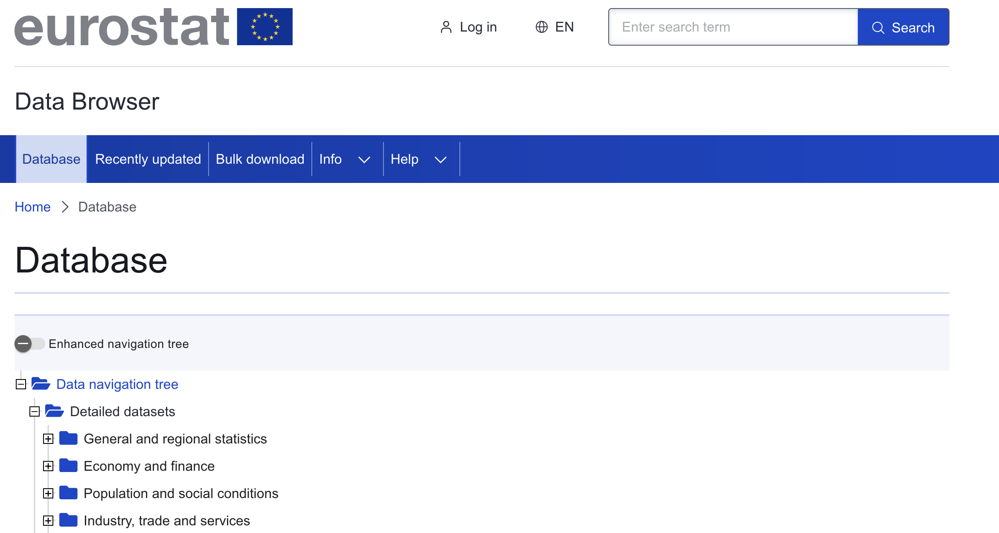

## Eurostat data browser

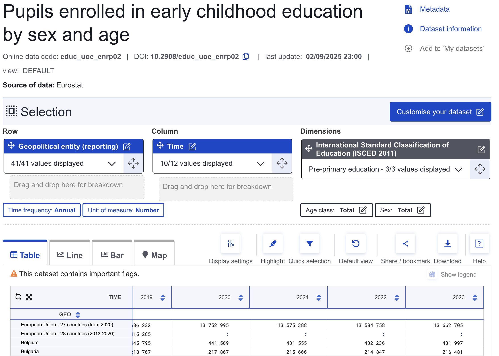

## For your exam

1. You must find and choose 2 dimensions (2 variables) in Eurostat data to explore in your analysis.
2. You must download the data from Eurostat.
3. You must then combine (match) the different files together.
4. This will form your dataset to be used in your data analysis.
5. You need to get the data for next week!
