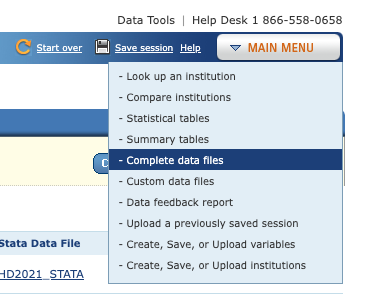
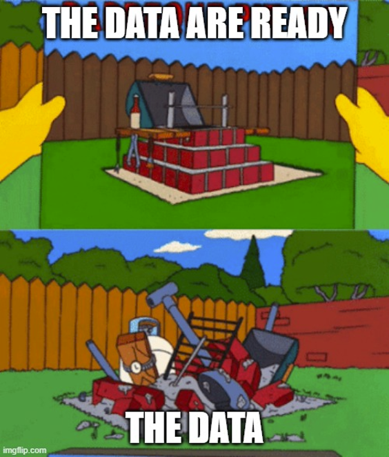
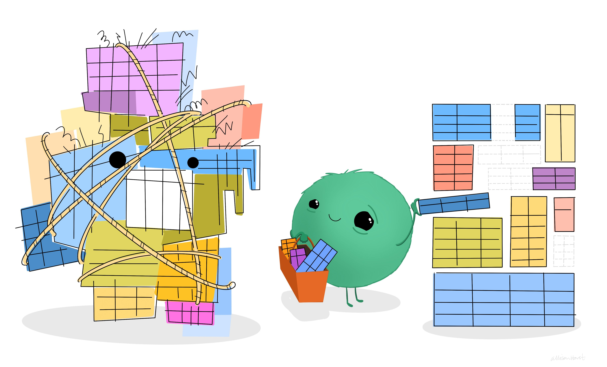
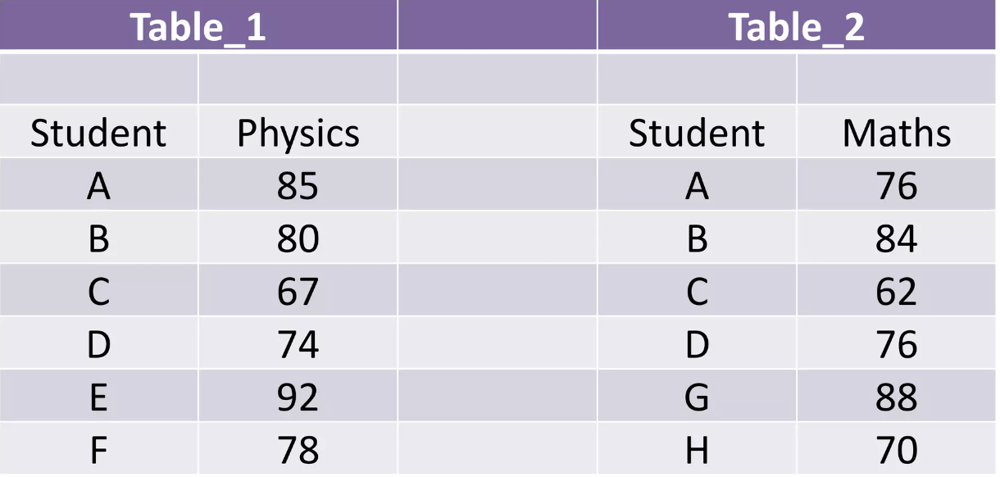
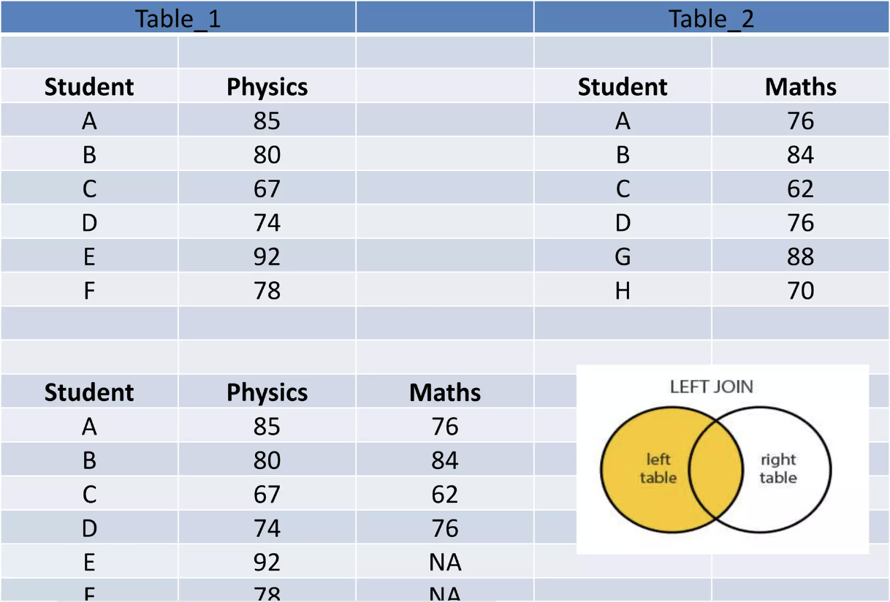
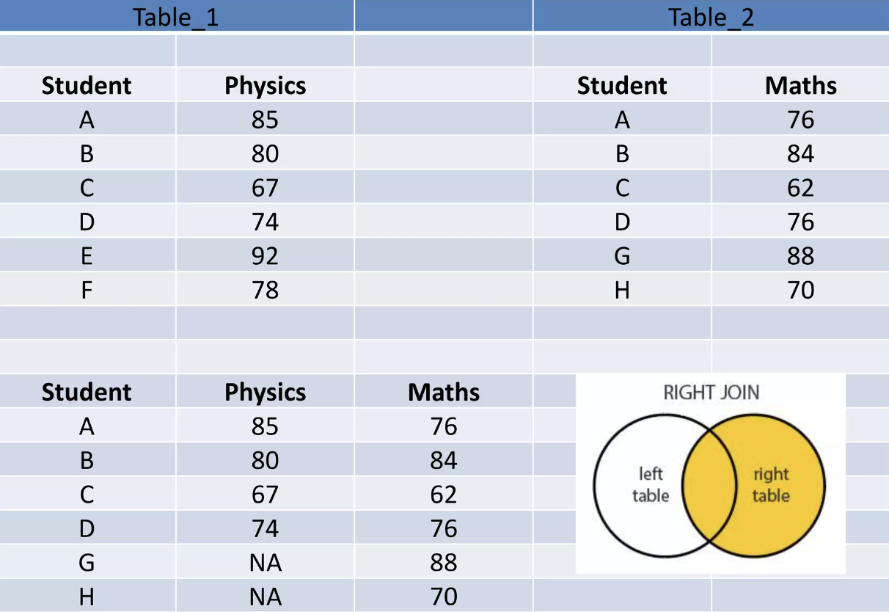
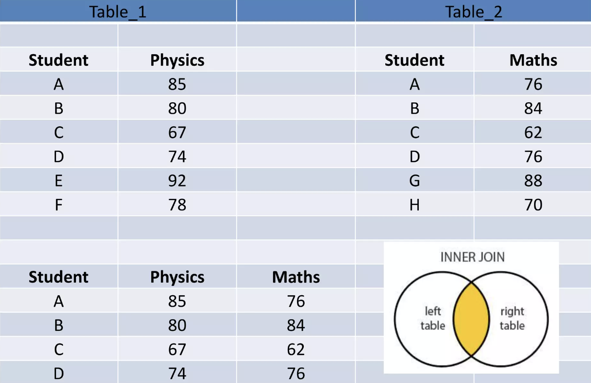
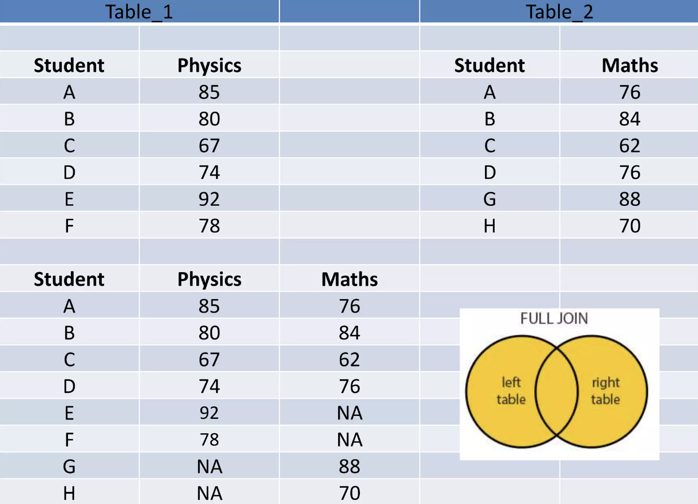

## Disclaimer {background-color="#F5F6F0"}

* The slides were adapted from those of Pierre Michel and Morgan Raux, both researchers at AMSE, who kindly shared their work.

* This slide deck was made with Quarto and reveal.js, it is translated by Claude Sonnet 5 from a LaTex presentation previously made with beamer.


## The 4 steps in any data analysis

1. **Finding data**
2. **Cleaning data to combine several data sources**
3. Producing knowledge out from data (summary statistics, regression analysis summarised via tables and graphs)
4. Interpreting the results (writing)

# Finding data {.part}

## How can we find data?

- Finding the most appropriate data is the most important part of any empirical project!
- Although, no one can teach you how to do that.
- We can only give you a few tips.
- Finding data is very time consuming.
- However, spending more time to be sure to find the best possible available data will make each following step easier.

## A few advices from Alex the Analyst

🌐 [Video on finding data](https://www.youtube.com/watch?v=PExdWWcxmro)

[](https://www.youtube.com/watch?v=PExdWWcxmro)

## Primary vs Secondary data

- The data we will find on these websites are secondary data.
- <span class="hl-green">Secondary data</span> is data that has already been collected, processed, and possibly analyzed by someone else for a different purpose than the current research project.
- <span class="hl-green">Primary data</span> is original data collected directly by the researcher or organization for a specific research purpose or project.
- You can collect your own primary data through survey collection, web-scraping, digitizing archives.


## Description and Aim of the Session

- In this session, we want to study the [relationship between the geographic distribution of universities and the likelihood to attend college education]{.gras-firstCol}.
- The hypothesis we want to explore is the following:
  - [Is the presence of a university in the county of residence of a given individual positively associated with the probability that this individual attends university?]{.gras-secondCol}

## Outline of the session

In this session, we are going to:

1. Find appropriate data to test this hypothesis empirically.
2. Clean and format the data.
3. Draw a few summary statistics to illustrate our topic of interest.
4. Run a few simple regressions to test this hypothesis.
5. Interpret the results.

## Finding data

The first step before coding is always to find the most appropriate data to test our hypothesis empirically.

- Question 1: What type of data do we want to test our hypothesis?

::: {.fragment}
- Question 2: What could be an appropriate unit of observation in our data to test this hypothesis?
:::

## Data strategy

- Morgan Raux has collected for you US labor force data for year 2018.
- This data covers a representative sample of US workers and includes information on their college education status and the county of residence of their parents.
- We now want to find [data on the geographic distribution of US universities]{.gras-firstCol}.
- The ideal dataset we want is the list of US colleges with information on their [location county]{.gras-firstCol}.
- After finding such data, we can **combine** the two datasets and test our hypothesis.

## Set Your RStudio Project {.exercise .small}

```{r}
#| echo: false
countdown::countdown(
  minutes = 5,
  seconds = 0,
  top = "0%",
  right = "5%",
  font_size = "1.8em",
  color_border = "#0d6efd",
  color_text = "#0d6efd"
)
```

:::: {.columns}
::: {.column width="30%"}
::: {.dirtree}
<span class="dir">Root</span><br>
&nbsp;&nbsp;<span class="dir">data</span><br>
&nbsp;&nbsp;&nbsp;&nbsp;<span class="dir">raw</span><br>
&nbsp;&nbsp;&nbsp;&nbsp;<span class="dir">tmp</span><br>
&nbsp;&nbsp;&nbsp;&nbsp;<span class="dir">out</span><br>
&nbsp;&nbsp;<span class="dir">functions</span><br>
&nbsp;&nbsp;<span class="dir">scripts</span><br>
&nbsp;&nbsp;<span class="dir">notebooks</span><br>
&nbsp;&nbsp;<span class="dir">figs</span><br>
&nbsp;&nbsp;<span class="dir">tables</span><br>
&nbsp;&nbsp;<span class="dir">references</span><br>
&nbsp;&nbsp;<span class="file">project.Rproj</span>
:::
:::
::: {.column width="70%"}


1. **Open RStudio**

2. **Create a new project**

   * `File` → `New Project...`
   * Choose **New Directory**
   * Create a project named `session-2`

3. **Create the project structure**

   In the R console, run:

```{r}
#| eval: false
#| echo: true
dir.create("data")
dir.create("data/raw")
dir.create("data/tmp")
dir.create("data/out")
dir.create("functions")
dir.create("scripts")
dir.create("notebooks")
dir.create("figs")
dir.create("tables")
dir.create("references")
```


:::
::::

## Exercise {.exercise}

```{r}
#| echo: false
countdown::countdown(
  minutes = 5,
  seconds = 0,
  top = "0%",
  right = "5%",
  font_size = "1.8em",
  color_border = "#0d6efd",
  color_text = "#0d6efd"
)
```

- Find the university dataset on the geographic distribution of US universities.
- Hint: the US statistical agency collecting data on US higher education is called IPEDS 
  * use the IPEDS Data Explorer; look for complete data files.
  * since we have data from 2018, let us use a survey from the same year.
- Once you have downloaded the data, put it in the `data/` folder of your project for session 2.

## Solution: Link to the Desired Dataset {.exercisesol}

::: {.columns}

::: {.column width="60%"}

- From the [IPEDS website's homepage](https://nces.ed.gov/), in the menu "Use the data", click on "Complete Data Files" to access the [data explorer tool](https://nces.ed.gov/ipeds/datacenter/DataFiles.aspx?year=2018&gotoReportId=7&sid=18837fb2-a1a9-4ce0-bb20-e8f909f3a963&rtid=1).
- On the main menu of this tool, we need to select "Complete data files".
- After filtering for year 2018, the dataset we are looking for appears, it is called HD2018.
  * [the dataset in a ZIP file](https://nces.ed.gov/ipeds/datacenter/data/HD2018.zip),
  * [a companion dictionary of variables](https://nces.ed.gov/ipeds/datacenter/data/HD2018_Dict.zip)

:::

::: {.column width="40%"}




:::

:::

# Coding Preamble {.part}

## What are functions? Libraries? and Loops?

Before getting further, we need to see 3 coding concepts that are key for `R`:

1. What is a function?
2. What is a library?
3. What is a loop?

## What is a Function in `R`?

- A <span class="hl-green">function</span> in `R` is a block of organized, reusable code that performs a specific task.
- Functions help to make code more modular, readable, and easier to debug and maintain.

## Key Components of a Function

A function in `R` is made of the following components:

- <span class="hl-purple">Function Name</span>: the name you use to call the function.
- <span class="hl-purple">Arguments</span>: inputs to the function, specified within parentheses.
- <span class="hl-purple">Body</span>: a set of statements that define what the function does, enclosed in curly braces `{}`.
- <span class="hl-purple">Return Value</span>: the result/output of the function:
  - You'll sometimes see people use the `return()` function to explicitly state what should be returned.
  - By default, the last evaluated expression of the body of the function is returned.
  - Hence, `return()` is mostly used for functions that contain conditional expressions (`if...else`).

## Syntax

```r
function_name <- function(argument_1, argument_2) {
    result <- argument_1 + argument_1 # Example of operation

    result # The last instruction in the body is what is returned
}
```

## Example

```r
#' Addition of two numbers
#' 
#' @param x First number.
#' @param y Second number.
#' @returns The sum of x and y.
add_numbers <- function(x, y) {
    sum <- x + y

    sum
}
```

```r
# Call the function with arguments:
add_numbers(x = 2, y = 3)
```

## Exercise {.exercise}

```{r}
#| echo: false
countdown::countdown(
  minutes = 5,
  seconds = 0,
  top = "0%",
  right = "5%",
  font_size = "1.8em",
  color_border = "#0d6efd",
  color_text = "#0d6efd"
)
```

Write a function called `pct_change()` that takes two arguments, `old_value` and `new_value`, and returns the percentage change between them.

- Recall: percentage change $= \dfrac{\text{new} - \text{old}}{\text{old}} \times 100$
- Test it with `pct_change(old_value = 80, new_value = 100)` (it should return `25`).


## What is a Library in `R`?

- A <span class="hl-green">library</span> in `R` is a collection of **functions** and associated help pages, (and, optionally, **data**), and compiled code in a well-defined format.
- Libraries (or packages) extend the functionality of `R` by adding new features.
- The most basic functions are in the `base` package, loaded by default when you launch `R`.

## Key Features of Libraries

- **Reusable Code**
  - Libraries contain reusable functions and datasets.
- **Community Contributions**
  - Thousands of libraries are available, many contributed by the `R` community.
- **Specialized Functions**
  - Libraries provide specialized tools for specific tasks, such as data manipulation, visualization, machine learning, and more.

## Using Libraries in R {.small}

- **Installing a Library:**
  - Use the `install.packages("libraryname")` function to install a library.
- **Loading a Library:**
  - Use the `library(libraryname)` function to load an installed library.

::: {.warning}
<span class="box-title">Do not mix the two!</span>
There is no need to install the library each time you want to use it. Just load it. Here is an analogy:

- Installing → downloading the app from the App Store / Google Play.
- Loading → tapping the app to open it and use it.
- You do not reinstall WhatsApp every time you want to send a message, you just open it.
:::

## What is a Loop in R?

- A <span class="hl-green">loop</span> in `R` is a control flow statement that allows code to be executed repeatedly based on a condition.
- Loops help to automate repetitive tasks and perform iterations over collections of data.
- Each repetition of the instructions of the code is called an <span class="hl-green">iteration</span>.

## Types of Loops in R

There are two types of loops:

- <span class="hl-purple">for loop</span>: iterates over a sequence of elements.
  - The computer knows in advance how many iterations this will take.
- <span class="hl-purple">while loop</span>: repeats a block of code until a condition is met (is `TRUE`).
  - The computer does not know in advance how many iterations this will take.

## for Loop Syntax and Example

Syntax:

```r
for (variable in iterable_object) {
    # Instruction(s) to execute
}
```

Example:

```r
# Print the squares of the integers from 1 to 5
for (i in 1:5) {
    j <- i^2
    print(j)
}
```

## while Loop Syntax and Example

Syntax:

```r
while (condition) {
    # instructions to execute
}
```

Example:

```r
# Print the squares of the integers until the current integer 
# is lower or equal to 5
i <- 1 # initialize the counter to 1
while (i <= 5) {
    j <- i^2
    print(j)
    i <- i + 1 # Increment the counter
}
```

## Exercise {.exercise}

```{r}
#| echo: false
countdown::countdown(
  minutes = 5,
  seconds = 0,
  top = "0%",
  right = "5%",
  font_size = "1.8em",
  color_border = "#0d6efd",
  color_text = "#0d6efd"
)
```

Write a `for` loop that prints for each integer from 1 to 10, whether it is even or odd.

- Recall: use the modulo operator `%%` to test divisibility (e.g., `i %% 2 == 0` is `TRUE` when `i` is even).

# Importing data {.part}

## Manage the Working Directory

To print the path to the **current** working directory (set by default):

```r
getwd()
```

The working directory can be assigned by the user using the following command:

```r
setwd("C:/Users/myName") # Windows example
```

:::{.callout-important}

### Bad Practice!

Changing manually the working directory is bad practice: when you share your codes, it quickly becomes a nightmare to others who have to modify your scripts to change the working directory on their end.

Use RStudio's projects instead. The working directory becomes the same as that which contains the `.Rproj` file.

:::

## Importing data

- Common data importing functions
  - `read_csv()`, `read_delim()` from the `readr` package
  - `read_excel()` from the `readxl` package
  - `read_sav()`, `read_sas()`, `read_dta()` from the `haven` package
- Learn more about importing multiple files at once [🌐 here](https://github.com/Cghlewis/data-wrangling-functions/wiki/Import-Files).

## Import text files

To load text files (e.g., the <a href="data/age_gender.txt" class="btn btn-light btn-sm" data-toggle="dropdown" aria-haspopup="true" aria-expanded="false"> age_gender.txt file</a>s stored in your computer, use the function `read.table()`.

`read.table(file, sep, header)`

- `file`: the name of the file (character)
- `sep`: separator used in file (" " by default)
- `header`: `TRUE` if file contains column names, `FALSE` by default

```r
tab <- read.table(file = "data/age_gender.txt", header = TRUE)
head(tab, 3)
```

| age | gender |
|:---:|:------:|
| 28 | F |
| 36 | H |
| 45 | F |

## Import text files: variants of read.table()

- `file.choose()`: choose a file through the GUI.
- `read.csv()`: read CSV files.
- `read.delim()`: read delimited text files.
- `read.fwf()`: read fixed-width-formatted files.

R can read files in specific software formats (Excel, SAS, SPSS, Stata) using the functions from the `foreign` package.

```r
# Try this
install.packages("foreign")
library(foreign)
?read.dta
```

## Export text files

To export a `data.frame` into text files in your working directory: `write.table()`.

`write.table(x, file, append, col.names, row.names)`

- `x`: `data.frame`.
- `file`: name of the file in which to write.
- `append`: if `TRUE`, add to an (eventually existing) file, if `FALSE`, overwrite the existing file (default).
- `col.names` and `row.names`: if `TRUE`, write the columns/rows names.

```r
write.table(tab, "age_gender.txt", row.names = TRUE,
col.names = TRUE)
```

💡 `write()` is similar to `write.table()`, with fewer options.

## Save/Load R objects

R objects can be saved in both ascii and binary formats:

- `dump()`: save R objects in ascii format.
- `source()`: load R objects saved with `dump()`.
- `save()`: save R objects in binary format.
- `load()`: load R objects saved with `save()`.

```r
# Try this
dump(ls(), file = "objects.txt")
source("objects.txt")

save(iris, mtcars, file = "iris_and_mtcars.rda")
load("iris_and_mtcars.rda")
```

## Exercise: Import {.exercise}

```{r}
#| echo: false
countdown::countdown(
  minutes = 5,
  seconds = 0,
  top = "0%",
  right = "5%",
  font_size = "1.8em",
  color_border = "#0d6efd",
  color_text = "#0d6efd"
)
```

- Import the `HD2018.csv` file you downloaded from IPEDS into an object called `universities`.
- Also import the labor force survey data, available on AMeTICE (Moodle) as `US_labor_force_survey.dta`, into an object called `survey`. Use the following instruction:
```r
  survey <- haven::read_dta("data/US_labor_force_survey.dta")
```
- Put both files in the `data/` folder of your project for session 2 before importing them.

## Solution: Import {.exercisesol}

```{r}
#| message: false
#| warning: false
library(tidyverse)
# University dataset (CSV)
universities <- read_csv("data/HD2018.csv")

# Labor force survey (Stata format)
survey <- haven::read_dta("data/US_labor_force_survey.dta")
```


- `read.csv()` (base R) or `readr::read_csv()` both work for the `.csv` file; the latter is faster and returns a tibble.
- `haven::read_dta()` is needed for the `.dta` file, since Stata's binary format is not plain text.


# What is a Clean Dataset? {.part}

## Data are ready



## Six Data quality indicators

:::: {.columns}
::: {.column width="50%"}
1. Analyzable
2. Interpretable
3. Complete
4. Valid
5. Accurate
6. Consistent
:::
::: {.column width="50%"}

:::
::::

## Analyzable

- Data should make a rectangle of rows and columns.
- The first row, and only the first row, is your variable names (otherwise: `skip`).
- The remaining data should be made up of values in cells.
- At least one column uniquely defines the rows in the data (e.g., unique identifier).


## Analyzable

- Column values are analyzable.
- Information is explicit.


## Analyzable

- Only one piece of information is collected per variable.


- Otherwise: `separate_rows()`.

## Exercise {.exercise .smaller}

```{r}
#| echo: false
countdown::countdown(
  minutes = 1,
  seconds = 0,
  top = "0%",
  right = "5%",
  font_size = "1.8em",
  color_border = "#0d6efd",
  color_text = "#0d6efd"
)
```


What data quality issues do you detect for the **analyzable** indicator?


## Solution {.exercisesol}

- Data do not make a rectangle.
- Color coding used to convey information.
- More than one piece of information in a variable.
- Blank values implied to be 0 for Q4 variables.


## Interpretable

- Variable names **should** be machine-readable:
  - Unique.
  - No spaces or special characters except underscore (`_`),
    - This includes no dot (`.`) or hyphen (`-`),
  - Not begin with a number (should begin with a letter),
  - Character limit of 32 is better.
- Variable names should be human-readable:
  - Meaningful (`gender` instead of `X1`),
  - Consistently formatted (capitalization and delimiters),
  - Consistent order of information.

## Exercise {.exercise .smaller}

```{r}
#| echo: false
countdown::countdown(
  minutes = 1,
  seconds = 0,
  top = "0%",
  right = "5%",
  font_size = "1.8em",
  color_border = "#0d6efd",
  color_text = "#0d6efd"
)
```


What data quality issues do you detect for the **interpretable** indicator?


## Solution {.exercisesol}

- Spaces and special characters used in variable names.
- Some variable names are unclear.
- Inconsistent use of capitalization.


## Complete

- Observations
  - The number of rows in your dataset should sum to your sample size $N$ (excluding header):
    - No missing observations,
    - No duplicate observations (i.e., no unique identifier repeated).
- Variables
  - The number of columns in your dataset should total to what you planned to have:
    - No missing variables,
    - No unexpected missing data,
    - If you collected the data, it should exist in the dataset.

## Exercise {.exercise .smaller}

```{r}
#| echo: false
countdown::countdown(
  minutes = 1,
  seconds = 0,
  top = "0%",
  right = "5%",
  font_size = "1.8em",
  color_border = "#0d6efd",
  color_text = "#0d6efd"
)
```


What data quality issues do you detect for the **complete** indicator?


## Solution {.exercisesol}

- The data contain a duplicate ID (104).


## Valid

- Variables conform to the planned constraints:
  - Planned variable types (e.g., `numeric`, `character`, `date`),
  - Allowable variable values and ranges (e.g., $[1,5]$),
  - For surveys: item-level missingness aligns with variable universe rules and skip patterns.


## Exercise {.exercise .smaller}

```{r}
#| echo: false
countdown::countdown(
  minutes = 1,
  seconds = 0,
  top = "0%",
  right = "5%",
  font_size = "1.8em",
  color_border = "#0d6efd",
  color_text = "#0d6efd"
)
```


What data quality issues do you detect for the **valid** indicator?


## Solution {.exercisesol}

- `AGE/YR` does not adhere to our planned variable type.
- Values in `Score` fall out of our expected range.


## Accurate

- Information should be accurate based on any implicit knowledge you have.
  - For instance, maybe you know a student is in 2nd grade because you've interacted with that student, but their grade level is shown as 5th in the data.
- Accurate within and across sources
  - A date of birth collected from school records should match the date of birth provided by the student.
  - If a student is in 2nd grade, they should be associated with a second grade teacher.

## Exercise {.exercise .smaller}

```{r}
#| echo: false
countdown::countdown(
  minutes = 1,
  seconds = 0,
  top = "0%",
  right = "5%",
  font_size = "1.8em",
  color_border = "#0d6efd",
  color_text = "#0d6efd"
)
```


What data quality issues do you detect for the **accurate** indicator?


## Solution {.exercisesol}

- ID 105 has conflicting information for `TEACHING LEVEL` and `SCHOOL`.


## Consistent

- Variable values must be consistently measured, formatted, or categorized within a column.
- Variables must be consistently measured across collections of the same form.


## Exercise {.exercise .smaller}

```{r}
#| echo: false
countdown::countdown(
  minutes = 1,
  seconds = 0,
  top = "0%",
  right = "5%",
  font_size = "1.8em",
  color_border = "#0d6efd",
  color_text = "#0d6efd"
)
```


What data quality issues do you detect for the **consistent** indicator?


## Solution {.exercisesol}

- Values for `GENDER` are not consistently categorized.


## Recap: Data validation {.small}

:::: {.columns}
::: {.column width="50%"}
- [Complete]{.gras-firstCol}
  - Check for missing/duplicate cases
  - Check Ns by groups for completeness
  - Check for missing/too many columns
- [Valid and consistent]{.gras-firstCol}
  - Check for unallowed categories/values out of range
  - Check ranges by groups
  - Check for invalid, non-unique, or missing study IDs
:::
::: {.column width="50%"}
- [Consistent]{.gras-firstCol}
  - Check for incorrect variable types/formats
  - Check missing value patterns
- [Accurate]{.gras-firstCol}
  - Agreement across variables
- [Interpretable]{.gras-firstCol}
  - Variables correctly named
:::
::::

## Standard Data Cleaning Checklist

:::: {.columns}
::: {.column width="50%"}
- Import the raw data
- Review the raw data
- Find missing data
- Adjust the sample
- Drop irrelevant columns
- Split columns
- Rename variables
- Normalize variables
:::
::: {.column width="50%"}
- Standardize variables
- Update variable types
- Recode variables
- Construct new variables
- Validate data
- Join datasets
- Reshape data
- Save clean data
:::
::::


<!-- ## Import Raw data -->

<!--  -->

<!-- ## Review data -->

<!--  -->

<!-- ## Find missing data -->

<!--  -->

<!-- ## Adjust the sample -->

<!--  -->

<!-- ## Drop irrelevant columns -->

<!--  -->

<!-- ## Split columns -->

<!--  -->

<!-- ## Rename variables -->

<!--  -->

<!-- ## Normalize variables -->

<!-- - Compare the variable types in your raw data to the types you expected in your data dictionary. -->
<!-- - Do they align? If not, what needs to be done for them to align? -->

<!--  -->

<!-- ## Standardize variables -->

<!-- - Are columns consistently measured, categorized, and formatted according to your data dictionary? -->
<!-- - If not, what needs to be done so that they are? -->

<!--  -->

<!-- ## Update variable types -->

<!--  -->

<!-- ## Recode variables -->

<!--  -->

<!-- ## Construct additional variables -->

<!--  -->


<!-- ## Export data -->

<!-- - When you export your files, it is important to name them consistently and clearly. -->
<!--   - Follow rules similar to our variable naming rules, -->
<!--   - Machine-readable (except now `-` is allowed), -->
<!--   - Human-readable, -->
<!--   - A user should be able to understand what the file contains without opening it. -->

<!-- ::: {.tip} -->
<!-- <span class="box-title">Question</span> -->
<!-- Which gives you a better idea of what is in the file? -->

<!-- - `"Project X Full Data.csv"` -->
<!-- - `"projectx_wave1_stu_svy_clean.csv"` -->
<!-- ::: -->

# Data Preparation with R {.part}

## Working with the HD2018 dataset

- We will be working on the `HD2018` dataset (IPEDS 2018, Directory information) that you imported earlier.
- This dataset contains one row per US higher education institution, with variables describing its name, location, sector, and control (public/private).
- We are going to use a handful of `{dplyr}` verbs to explore and clean this dataset:
  - `select()`, `mutate()`, `summarise()`, `group_by()`, `count()`
- We will need the following library:
```{r}
#| message: false
#| warning: false
library(tidyverse)
```

## A Glimpse at the Dataset

```{r}
glimpse(universities)
```

## Core Syntax of `dplyr`

* The functions in `{dplyr}` are designed for tabular data, they are built specifically to manipulate `data.frame` and `tibble` objects (more modern tables).
* Every action is defined by a descriptive function, named a [verb]{.gras-firstCol}.
  * Example: `mutate()`{.R} creates, modifies, or deletes columns.
* `{dplyr}` adopts a consistent function syntax:

$$
\text{verb}(\underbrace{.data}_{\text{1st argument}},\, \underbrace{other\, arguments}_{\text{2nd to } n\text{-th arguments}})
$$

::: {.callout-note}
## Key Property of `dplyr` Verbs
The first argument is always a data frame, and the function always returns a new data frame. This structure makes chaining with pipes (`|>`) intuitive (see next slide).
:::


## The Pipe Operator (`|>`{.R} or `%>%`{.R})

The pipe operator passes the output of the left side as the [first argument]{.gras-firstCol} to the function on the right side. 

$$
\text{data} \;\mathbf{|>}\; \text{verb}_1(\dots) \;\mathbf{|>}\; \text{verb}_2(\dots)
$$

### The Data Refining Pipeline


```{mermaid}
%%| echo: false
flowchart LR
    A["<b>Crude Oil</b><br/><br/>Raw Dataset"]
    B["<b>Refinery Station 1</b><br/><br/><code>filter(...)</code>"]
    X["<b>More stations...</b><br/><br/><code>verb(...)</code>"]
    C["<b>Refinery Station N</b><br/><br/><code>mutate(...)</code>"]
    D["<b>Premium Fuel</b><br/><br/>Clean Data"]

    A -->|"|>"| B
    B -->|"|>"| X
    X -->|"|>"| C
    C -->|"|>"| D

    style A fill:#ffe5cc,stroke:#cc6600
    style B fill:#e6f0ff,stroke:#3366cc
    style X fill:#f5f5f5,stroke:#888888,stroke-dasharray: 5 5
    style C fill:#e6f0ff,stroke:#3366cc
    style D fill:#e5f5e5,stroke:#339933

```

## Why Using The Data Refining Pipeline?

::: {.columns}

::: {.column width="50%"}
* **Nested Syntax (Hard to Read):**

```{r}
#| echo: true
#| eval: false
# Evaluated inside-out!
summarise(
  group_by(
    filter(universities, STABBR == "AL"),
    COUNTYNM
  ),
  n_estab = n()
)

```

:::

::: {.column width="50%"}

* **Piped Syntax (Reads Left-to-Right):**

```{r}
#| echo: true
#| eval: false
# Clean, sequential data flow!
universities |>
  filter(STABBR == "AL") |>
  group_by(COUNTYNM) |>
  summarise(n_estab = n())

```

:::

:::

::: {.callout-tip}

## Native Pipe vs. Magrittr

Use the native R pipe `|>`{.R} (R $\ge$ 4.1.0). In older code bases, you may also see the `{magrittr}` pipe `%>%`{.R}.
:::


## `select()` {.small}

- `select()` lets you keep (or drop) specific columns of a dataset.

```{r}
univ <- universities |>
  select(
    UNITID, INSTNM, STABBR, SECTOR, CONTROL,
    COUNTYCD, COUNTYNM
  )
```

- `UNITID`: unique institution identifier
- `INSTNM`: institution name
- `STABBR`: state abbreviation
- `SECTOR`, `CONTROL`: sector and control (public/private) codes
- `COUNTYCD`, `COUNTYNM`: county code and name


::: {.tip}
<span class="box-title">Tip</span>
You can also drop columns with a minus sign: `select(universities, -ZIP)` keeps everything except `ZIP`.
:::

## `mutate()`

- `mutate()` creates new columns, or modifies existing ones.

```{r}
univ <- univ |>
  mutate(
    is_public = ifelse(CONTROL == 1, TRUE, FALSE)
  )
```


- Here, we create a new logical column `is_public`, equal to `TRUE` when the institution is public (`CONTROL == 1`).

```{r}
univ |> head(n = 5)
```


## `summarise()`

- `summarise()` collapses a dataset into one (or a few) summary rows.

::: {.columns}

::: {.column width="50%"}

```{r}
#| eval: false
#| code-line-numbers: "1-5"
univ |>
  summarise(
    n_institutions = n(),
    n_states = n_distinct(STABBR)
  ) |> 
  print(n = 4)
```

:::

::: {.column width="50%"}
```{r}
#| echo: false
univ |>
  summarise(
    n_institutions = n(),
    n_states = n_distinct(STABBR)
  ) |> 
  print(n = 4)
```

:::

:::

- `n()`: counts the number of rows.
- `n_distinct()`: counts the number of unique values of a variable.

## `group_by()` {.smaller}

- `group_by()` splits the dataset into groups, so that subsequent verbs (like `summarise()` or `mutate()`) are applied **within each group** separately.

::: {.columns}

::: {.column width="50%"}

```{r}
#| eval: false
univ |>
  group_by(STABBR) |>
  summarise(n_institutions = n(), .groups = "drop")
```

:::

::: {.column width="50%"}

```{r}
#| echo: false
univ |>
  group_by(STABBR) |>
  summarise(n_institutions = n())
```

:::

:::


- This gives us the number of institutions **per state**.

::: {.tip}
<span class="box-title">Tip</span>
Always pair `group_by()` with `summarise()` or `mutate()` — on its own, `group_by()` does not change the data, it only changes how the following instructions behave.
:::

## `count()`

- `count()` is a shortcut that combines `group_by()`, `summarise(n = n())`, and `ungroup()` in a single step.

::: {.columns}

::: {.column width="50%"}

```{r}
#| eval: false
universities |>
    count(STABBR)

# Equivalent to:
universities |>
    group_by(STABBR) |>
    summarise(n = n())
```

:::

::: {.column width="50%"}

```{r}
#| echo: false
universities |>
    count(STABBR)
```

:::

:::

- Handy for a quick tally of a categorical variable.

## Dataset dimensions

- Before checking anything else, always start by looking at the overall size of your dataset.

```{r}
dim(universities)   # number of rows and columns
nrow(universities)   # number of rows
ncol(universities)   # number of columns
```

- Does the number of rows match the sample size you expected?
- Does the number of columns match what you planned to import?

## Missing values {.small}

::: {.columns}

::: {.column width="70%"}
- Missing values in R are coded as `NA`.

```{r}
# Count the number of missing values per column
colSums(is.na(universities))

# Total number of missing values in the whole dataset
sum(is.na(universities))
```
:::

::: {.column width="30%"}
- `is.na()` returns `TRUE`/`FALSE` for each cell.
- Combined with `colSums()`, it gives the number of missing values per column.

:::

:::


## Duplicate cases

- Duplicate rows (or duplicate identifiers) are a common data quality issue.

```{r}
# Are there any fully duplicated rows?
sum(duplicated(universities))

# Are there any duplicated identifiers (there should not be)?
sum(duplicated(universities$UNITID))

# Which identifiers are duplicated?
universities |>
    count(UNITID) |>
    filter(n > 1)
```


- `duplicated()` flags rows (or values) that have already appeared earlier in the vector.


## `arrange()`

- `arrange()` sorts the rows of a dataset by the values of one (or several) columns.

```{r}
#| code-line-numbers: "1-3"
universities |>
  count(STABBR) |>
  arrange(n) |> 
  print(n = 4)
```

- By default, `arrange()` sorts in **ascending** order.
- Use `arrange(desc(n))` instead to sort in **descending** order, if you want the largest groups first.

## Counting to check completeness

- `count()` is also very useful to check the completeness of your dataset by group.

```{r}
#| code-line-numbers: "1-3"
universities |>
  count(STABBR) |>
  arrange(n) |> 
  print(n = 4)
```

- Are there states with an unexpectedly low (or zero) number of institutions?
- This may signal a filtering issue, or missing values in `STABBR` itself.

## Checking the levels of a category

- For categorical variables, always check that the observed categories match what you expect.

:::{.columns}

::: {.column width="50%"}

```{r}
#| eval: false
# List the distinct values taken by a categorical variable
universities |>
    distinct(SECTOR)

# Or, with a count:
universities |>
    count(SECTOR)
```

:::

::: {.column width="50%"}

```{r}
#| echo: false
# Or, with a count:
universities |>
    count(SECTOR)
```

:::

:::


- Are all the values valid (i.e., part of the official IPEDS coding of `SECTOR`)?
- Are there unexpected categories (typos, placeholder codes, etc.)?

## Looking for outliers

- For numeric variables, always check the range of observed values.

```{r}
summary(universities$LONGITUD)
summary(universities$LATITUDE)
```


- Do the minimum and maximum values make sense?
  - E.g., a latitude outside of $[-90, 90]$ would be invalid.
- A quick plot can also help spot outliers visually:

```{r}
boxplot(universities$LATITUDE)
```


## Check ranges by groups

- Some ranges only make sense **within** a group — combine `group_by()` and `summarise()` to check them.

::: {.columns}

::: {.column width="50%"}
```{r}
#| eval: false
universities |>
  group_by(STABBR) |>
  summarise(
    min_lat = min(LATITUDE, na.rm = TRUE),
    max_lat = max(LATITUDE, na.rm = TRUE)
  )
```
:::

::: {.column width="50%"}
```{r}
#| echo: false
universities |>
  group_by(STABBR) |>
  summarise(
    min_lat = min(LATITUDE, na.rm = TRUE),
    max_lat = max(LATITUDE, na.rm = TRUE)
  )
```
:::

:::


## Checking variable types {.smaller}

- Each variable should have the type you expect (e.g., a state code should be a character, a coordinate should be numeric).

```{r}
# Check the type of a single variable
is.numeric(universities$LATITUDE)
is.character(universities$STABBR)

# Check the type of every column at once
sapply(universities, class)
```

## Checking variable types {.smaller}

- `is.numeric()`, `is.character()`, `is.logical()`, `is.factor()`: each returns `TRUE`/`FALSE`.
- `sapply(..., class)` applies `class()` to every column, giving you a full overview in one instruction.

::: {.tip}
<span class="box-title">Tip</span>
If a variable that should be numeric shows up as `character`, this is often a sign of a stray non-numeric value (e.g., `"n/a"` or a typo) somewhere in the column.
:::

## Exercise {.exercise}

```{r}
#| echo: false
countdown::countdown(
  minutes = 10,
  seconds = 0,
  top = "0%",
  right = "5%",
  font_size = "1.8em",
  color_border = "#0d6efd",
  color_text = "#0d6efd"
)
```

Using the `universities` dataset, write a pipeline that:

1. Creates a new column `sector_clean`, equal to `NA`{.R} when `SECTOR == 99`{.R}, and equal to `SECTOR` otherwise.
2. Groups the institutions by `sector_clean`.
3. Computes, for each group, the number of institutions and their average latitude (`LATITUDE`).
4. Sorts the result so that the group with the **lowest** average latitude appears first.


## Solution {.exercisesol}

```r
universities |>
    mutate(
        sector_clean = ifelse(SECTOR == 99, NA, SECTOR)
    ) |>
    group_by(sector_clean) |>
    summarise(
        n_institutions = n(),
        avg_latitude = mean(LATITUDE, na.rm = TRUE)
    ) |>
    arrange(avg_latitude)
```

- `mutate()`: recodes the placeholder value `99` as a genuine missing value (`NA`), so it doesn't get treated as a real sector.
- `group_by()`: splits the data by `sector_clean` (institutions with a missing sector form their own `NA` group).
- `summarise()`: computes one row per sector, with `n()` for the count and `mean(..., na.rm = TRUE)` for the average latitude.
- `arrange()`: sorts sectors from lowest to highest average latitude (i.e., from south to north).


# Joining data {.part}

## Joining data

- Joining is the mechanism which connects many datasets that are inter-related.
- Whenever the data we need are distributed across several different sources, we need to combine them together to implement the data analysis.
- Joining datasets requires identifying common key variables to perform the combination.

## The `dplyr` package

- We are going to use the `{dplyr}` package to join datasets.

```r
install.packages("dplyr")
library(dplyr)
```

## Four types of join

- `left_join()`
- `right_join()`
- `inner_join()`
- `full_join()`

See the [🌐 cheat sheet from dplyr](https://github.com/rstudio/cheatsheets/blob/main/data-transformation.pdf).

## Example

Let us consider a few examples to join these two tables.



## These tables in `R`

:::: {.columns}
::: {.column width="50%"}
```r
library(dplyr)
physics_class <- tribble(
  ~Student, ~Physics,
  "A", 85,
  "B", 80,
  "C", 67,
  "D", 74,
  "E", 92,
  "F", 78,
)
```
:::
::: {.column width="50%"}
```r
math_class <- tribble(
  ~Student, ~Maths,
  "A", 76,
  "B", 84,
  "C", 62,
  "D", 76,
  "G", 88,
  "H", 70,
)
```
:::
::::

## Requirements

- To join datasets, we first need to identify a common **key/identifier** across datasets.
- We then need to harmonize this common identifier across datasets (same format, same writing rules etc.).
- Question: what could be the common identifier in this example?
- Question: is the identifier harmonized across datasets?

## `left_join()`



## `right_join()`



## `inner_join()`



## `full_join()`




## Exercise: Testing our hypothesis {.exercise .smaller}

```{r}
#| echo: false
countdown::countdown(
  minutes = 15,
  seconds = 0,
  top = "0%",
  right = "5%",
  font_size = "1.8em",
  color_border = "#0d6efd",
  color_text = "#0d6efd"
)
```

Let us go back to the hypothesis from the beginning of this session:

::: {.tip}
Is the presence of a university in the county of residence of a given individual positively associated with the probability that this individual attends university?
:::

Using `universities` and `survey`, write a pipeline that answers this question. You will need to:

1. Harmonize the county and state names so they match across the two datasets (careful with upper/lower case).
2. In `survey`, create a binary variable `attend_university`, equal to `1` if the individual completed more than 12 years of education (`educ`), `0` otherwise.
3. In `universities`, count the number of institutions per county (`COUNTYNM`) and state (`STABBR`).
4. Join this count onto `survey`, matching on county and state.
5. Create a binary variable indicating whether the individual's county has **at least one** university.
6. Compare the proportion of individuals attending university, depending on whether their county has a university or not.

::: {.tip}
<span class="box-title">Hint</span>
`str_to_upper()` (from `{stringr}`) is useful to harmonize text casing before joining two datasets on a character key.
:::

## Solution {.exercisesol .smaller}

:::{.columns}

::: {.column width="40%"}
```{r}
universities <- universities |> 
  mutate(
    COUNTYNM = str_to_upper(COUNTYNM)
  )

survey <- survey |> 
  mutate(
    attend_university = as.integer(educ > 12),
    state = str_to_upper(state)
  )

tb_n_univ_counties <- universities |> 
  count(COUNTYNM, STABBR, name = "n_univ_county")

survey_univ <- survey |> 
  left_join(
    tb_n_univ_counties,
    by = c("county" = "COUNTYNM", "state" = "STABBR")
  )

survey_univ |> 
  mutate(
    univ_county = !is.na(n_univ_county)
  ) |> 
  count(univ_county, attend_university) |> 
  group_by(univ_county) |> 
  mutate(prop = n / sum(n))
```
:::

::: {.column width="60%"}


- `str_to_upper()`: harmonizes the casing of county/state names in both datasets, so the join key matches exactly.
- `mutate(attend_university = ...)`: recodes years of education into a simple binary outcome.
- `count(COUNTYNM, STABBR, name = "n_univ_county")`: counts institutions per county, renaming the result column directly.
- `left_join()`: attaches the university count to each individual, based on their county and state of residence.
- `!is.na(n_univ_county)`: individuals whose county has no matching row in `tb_n_univ_counties` get `NA`, meaning no university in their county.
- `group_by(univ_county) |> mutate(prop = n / sum(n))`: computes the proportion attending university, **separately** for individuals with and without a university in their county — this is the comparison that answers our hypothesis.

:::

:::


## Exercises {.exercise}

Practice with [the first tutorial](tutorial-1.html)!

You are expected to complete the exercises before the next session.
